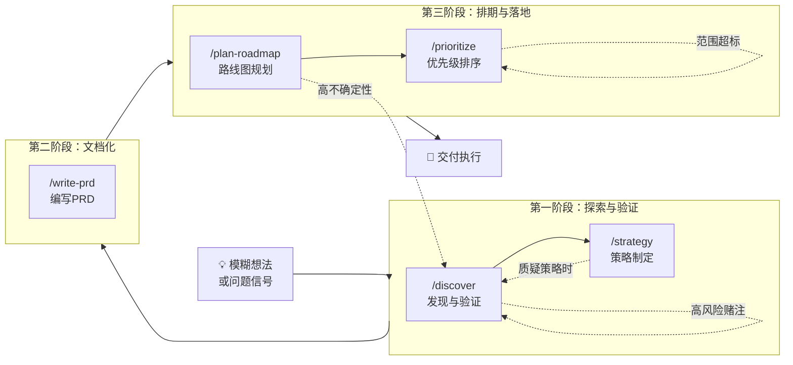
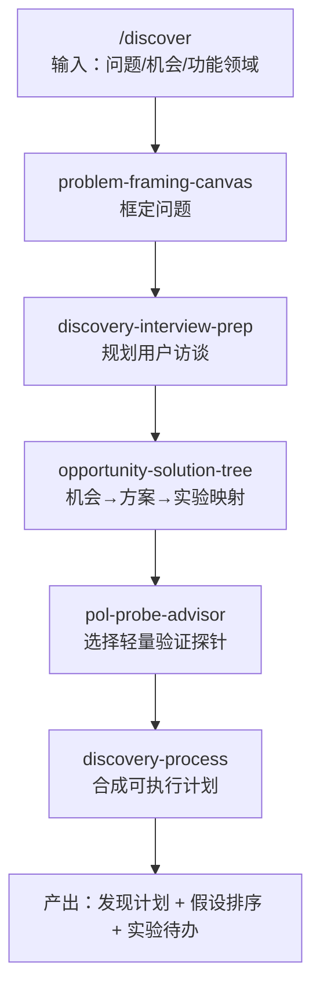
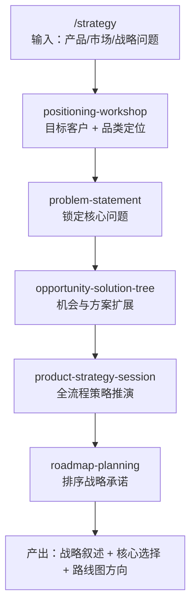
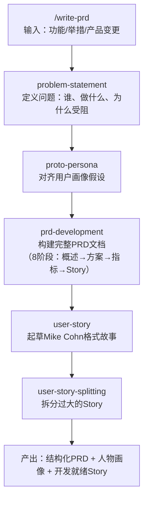
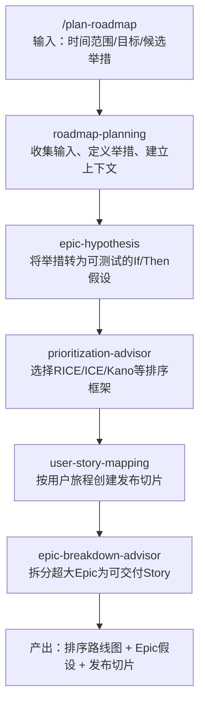
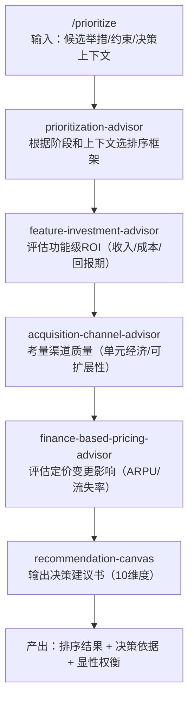
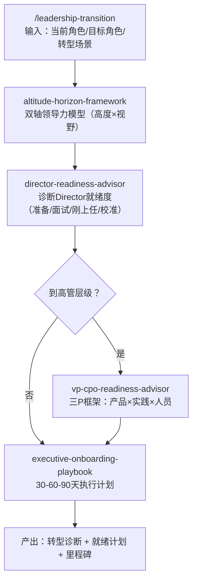
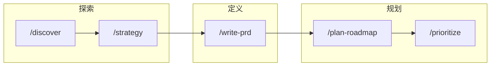
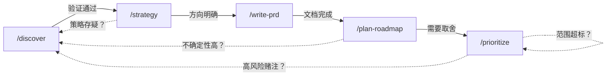

# Commands（命令系统）

Commands 是一套**产品管理 AI 辅助工作流系统**，围绕本地 PM 技能（Skills）进行编排封装。

- **Skills**：框架和教学法的唯一事实来源（47 个独立方法论模块）
- **Commands**：轻量级编排，将多个 Skill 串联为可执行工作流（6 个命令）
- **调用方式**：以 `/命令名 参数` 形式在 Agent 中直接调用

---

## 体系架构总览

```mermaid
graph TB
    subgraph "指令层 Commands"
        D["/discover<br/>发现与验证"]
        S["/strategy<br/>产品策略"]
        P["/write-prd<br/>编写PRD"]
        R["/plan-roadmap<br/>路线图规划"]
        PRI["/prioritize<br/>优先级排序"]
        L["/leadership-transition<br/>领导力转型"]
    end

    subgraph "技能层 Skills（47个）"
        subgraph "问题框定"
            PS["problem-statement"]
            PFC["problem-framing-canvas"]
            PPRO["proto-persona"]
        end
        subgraph "发现与研究"
            DP["discovery-process"]
            DIP["discovery-interview-prep"]
            OST["opportunity-solution-tree"]
            JTBD["jobs-to-be-done"]
        end
        subgraph "策略与定位"
            PSS["product-strategy-session"]
            PW["positioning-workshop"]
            PST["positioning-statement"]
        end
        subgraph "需求与文档"
            PRD["prd-development"]
            PR["press-release"]
            US["user-story"]
            USS["user-story-splitting"]
            USM["user-story-mapping"]
        end
        subgraph "规划与排序"
            RP["roadmap-planning"]
            PA["prioritization-advisor"]
            EH["epic-hypothesis"]
            EBA["epic-breakdown-advisor"]
        end
        subgraph "财务与决策"
            FIA["feature-investment-advisor"]
            FPA["finance-based-pricing-advisor"]
            ACA["acquisition-channel-advisor"]
            RC["recommendation-canvas"]
        end
    end

    D --> PFC
    D --> DIP
    D --> OST
    D --> DP
    S --> PW
    S --> PS
    S --> OST
    S --> PSS
    S --> RP
    P --> PS
    P --> PPRO
    P --> PRD
    P --> US
    P --> USS
    R --> RP
    R --> EH
    R --> PA
    R --> USM
    R --> EBA
    PRI --> PA
    PRI --> FIA
    PRI --> ACA
    PRI --> FPA
    PRI --> RC
    L --> AHF["altitude-horizon-framework"]
    L --> DRA["director-readiness-advisor"]
    L --> VRA["vp-cpo-readiness-advisor"]
    L --> EOP["executive-onboarding-playbook"]
```



---

## 产品需求工作流全景

以下 Mermaid 图展示了 **5 个产品需求类指令** 的完整协作链路和使用顺序：



---

## 指令详解

### 1. `/discover` — 发现与验证

**定位**：从模糊问题到可验证假设的完整发现闭环，是产品工作的**起点**。



| 维度 | 说明 |
|------|------|
| **适用场景** | 接到模糊需求、探索新机会、降低不确定性 |
| **输入** | 问题描述、机会领域或功能方向 |
| **产出** | 发现计划、按风险排序的假设清单、验证实验待办 |
| **调用示例** | `/discover 降低新SMB用户的引导流失率` |
| **后续指令** | 验证通过 → `/write-prd`；多路径 → `/prioritize` |

---

### 2. `/strategy` — 产品策略

**定位**：从市场定位到路线图方向的全栈策略推演，是产品工作的**方向盘**。



| 维度 | 说明 |
|------|------|
| **适用场景** | 新市场进入、产品线扩展、年度战略规划 |
| **输入** | 产品描述、市场背景、战略问题 |
| **产出** | 战略叙述、核心战略选择（含显性权衡和反目标）、路线图方向 |
| **调用示例** | `/strategy 面向中端市场电商品牌的B2B分析插件` |
| **后续指令** | 发布计划 → `/plan-roadmap`；顶层举措 → `/write-prd` |

---

### 3. `/write-prd` — 编写 PRD

**定位**：从策略到可交付故事的 PRD 文档生成，是产品工作的**设计图纸**。



| 维度 | 说明 |
|------|------|
| **适用场景** | 新功能开发、重大改造、需要工程交接的需求 |
| **输入** | 功能描述、举措名称或产品变更范围 |
| **产出** | 完整 PRD 文档、核心人物画像、可交付的 User Story |
| **调用示例** | `/write-prd 团队收件箱重新设计以加速客服分流` |
| **后续指令** | 排期 → `/plan-roadmap`；范围超标 → `/prioritize` |

---

### 4. `/plan-roadmap` — 路线图规划

**定位**：将战略与验证后的机会转化为有时间维度的交付路线图。



| 维度 | 说明 |
|------|------|
| **适用场景** | 季度规划、版本路线图、多团队交付协调 |
| **输入** | 时间范围（如Q3-Q4）、目标、候选举措列表 |
| **产出** | 优先级排序的路线图、Epic 假设声明、发布切片及排序依据 |
| **调用示例** | `/plan-roadmap 面向企业报表和权限的Q3-Q4计划` |
| **后续指令** | 顶层切片 → `/write-prd`；高不确定性 → `/discover` |

---

### 5. `/prioritize` — 优先级排序

**定位**：融合财务严谨性与战略判断的决策排序，是产品工作的**资源分配器**。



| 维度 | 说明 |
|------|------|
| **适用场景** | 待办清单过剩、资源有限、需要向管理层汇报决策依据 |
| **输入** | 候选举措、资源约束、决策上下文 |
| **产出** | 排序后的选项、每项决策依据、显性权衡与置信度标注 |
| **调用示例** | `/prioritize 面向激活、留存和定价实验的Q2待办清单` |
| **后续指令** | 高风险赌注 → `/discover`；已批准 → `/plan-roadmap` |

---

### 6. `/leadership-transition` — 领导力转型

**定位**：PM → Director → VP/CPO 的角色跃迁辅导，属于**职业发展**方向，非产品需求类指令。



| 维度 | 说明 |
|------|------|
| **适用场景** | 晋升准备、面试新角色、刚入职适应、定期校准 |
| **输入** | 当前角色、目标角色、转型场景描述 |
| **产出** | 转型诊断报告、角色就绪计划、前 30-60-90 天行动清单 |
| **调用示例** | `/leadership-transition 高级PM向规模化SaaS公司首个Director角色转型` |
| **后续指令** | 季度校准重跑；配合 `/strategy` 可同步调整产品方向 |

---

## 使用指南

### 标准产品需求流水线



**推荐顺序**：
1. 拿到模糊需求 → 先跑 `/discover` 降低不确定性
2. 验证通过后 → 跑 `/strategy` 确定战略方向
3. 方向明确后 → 跑 `/write-prd` 产出需求文档
4. 需要排期 → 跑 `/plan-roadmap` 生成路线图
5. 资源受限 → 跑 `/prioritize` 做出取舍

### 返工循环

不是线性的——每个阶段都可能回溯：



### 快速决策矩阵

| 你的情况 | 用哪个指令 |
|----------|-----------|
| "用户反馈了一个问题，不确定值不值得做" | `/discover` |
| "要做新产品线/进入新市场，需要方向" | `/strategy` |
| "方向定了，需要写详细需求文档" | `/write-prd` |
| "有多个需求，不知道Q3先做哪个" | `/plan-roadmap` |
| "资源不够，需要砍需求/做取舍" | `/prioritize` |
| "准备升Director，需要评估差距" | `/leadership-transition` |

---

## 命令文件格式

每个命令文件为带 YAML frontmatter 的 Markdown：

```yaml
---
name: command-name          # 命令名
description: 功能描述        # 一句话说明
argument-hint: "<用户应提供的内容>"  # 参数提示
uses:                       # 依赖的Skill列表
  - skill-name
  - another-skill
outputs:                    # 交付物
  - 产物1
  - 产物2
---
```

---

## 校验与发现

```bash
# 校验命令元数据
python3 scripts/check-command-metadata.py

# 查找命令
./scripts/find-a-command.sh --list-all
./scripts/find-a-command.sh --keyword roadmap
```
