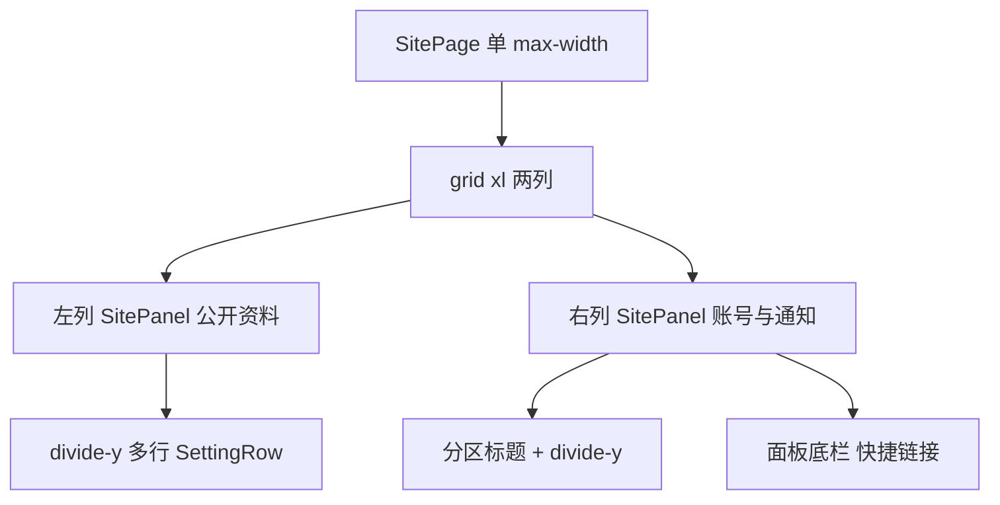

# 设置页布局与样式重构

## 现状（问题来源）

- 主文件：[apps/web/src/routes/settings-page.tsx](D:\CodeStore\feijia\apps\web\src\routes\settings-page.tsx)。
- **SettingCard**（约 71–90 行）：每个字段独立 `rounded-2xl border bg-white`，块面多、间距大（`space-y-4` / `space-y-8`），左右栏高度差明显。
- **页面宽度**：`SitePage` 使用 `max-w-[72rem]`，内层 grid 再用 `max-w-[76rem]`，重复且与「顶栏已全宽」略脱节；可统一为单一 `max-w`（建议与 [`--page-width`](D:\CodeStore\feijia\apps\web\src\styles.css) 或 `76rem` 对齐）。
- **按钮**：编辑多为 `outline`，通知开关为 `panel`/`outline` 切换，与保存 `hero` 并存，视觉层级杂。
- **底栏操作**（约 678–707 行）：三块 `outline` 横排在右列底部，与上方卡片分离感强。

## 目标结构

## 实现方案

### 1. 抽取可复用块（仍在 `settings-page.tsx` 内，避免过度拆文件）

- **`SettingsPanel`**：`SitePanel` + `variant="muted"` 或 `default`，统一 `overflow-hidden border border-border/60`（与 [site-shell](D:\CodeStore\feijia\apps\web\src\components\site-shell.tsx) 的 panel 语义一致）。
- **`SettingsPanelHeader`**：面板顶条 `px-4 py-3` + `border-b border-border/60` + `bg-muted/15`（或等价），放区块标题（如「公开资料」「账号与安全」）。
- **`SettingsRow`**：默认一行三栏布局——**标题**（`text-sm font-medium`）+ **内容区**（`min-w-0 flex-1`，放说明/值/表单）+ **操作**（`shrink-0`，按钮组）；行容器 `px-4 py-3.5`，行间用 **`divide-y`** 或 [Separator](D:\CodeStore\feijia\apps\web\src\components\ui\separator.tsx) 分隔。
- **头像行**：首行可 `col-span` 式全宽：上排仍为标题+「编辑」，下排 `flex flex-col gap-3 sm:flex-row sm:items-center`，避免与说明文字 `flex-wrap` 抢高度。

### 2. 左列：一个面板聚合「公开资料」

- 将现有 4 个 **SettingCard**（头像、昵称、简介、可见范围）改为 **单个 `SettingsPanel`**，内部 4 个 **`SettingsRow`**（可见范围编辑态下的三列卡片选择器仍放在该行内容区内，保持现有逻辑）。
- 去掉外层重复的 `text-lg` 节标题，或改为 **面板 header** 唯一主标题，避免「大标题 + 卡片标题」双重。

### 3. 右列：一个面板聚合「账号与安全」+「通知」+ 底栏

- **账号与安全**：第一个 `SettingsPanelHeader` 或面板内 `SettingsSubsectionTitle`（小号 uppercase / tracking）+ 绑定手机一行。
- **通知**：用 **分隔条**（`border-t` 或 Separator）与上区分，子标题「通知」+ 两条提醒行；开关按钮统一为 **`size="sm"` + `rounded-full`**，开启态 `variant="default"` 或 `hero`，关闭态 `variant="outline"`（或统一 `ghost` + 文案「开/关」），与「编辑」区分：编辑统一 **`variant="ghost"`** + 图标（减轻方框感）。
- **底部快捷链接**：移入 **同一面板底部** `border-t bg-muted/10 px-4 py-3`，`flex flex-wrap gap-2`，次要链可用 `Button variant="ghost" size="sm"`，退出可用 `variant="outline"` 或 `destructive` outline，与中间表单项分离感减弱。

### 4. 页面级

- 使用 **`SitePageHead` + `SitePageTitle`（及可选 `SitePageDescription`）** 作为整页标题（例如「设置」+ 一句说明），与 [protected-route / profile](D:\CodeStore\feijia\apps\web\src\features\auth\protected-route.tsx) 等页面层级一致（若当前路由无独立标题，可仅加 Title）。
- **grid**：`gap-6 xl:grid-cols-[minmax(0,1.2fr)_minmax(0,0.85fr)]` 或类似，让右列略窄、信息更集中，减轻「右短左长」空洞感；`xl:items-start` 保留。
- **删除内层重复 `max-w-[76rem]`**，只保留 `SitePage` 一层 `max-w-* mx-auto w-full`。

### 5. 骨架屏

- 更新 **`SettingsPageSkeleton`**（约 57–68 行）为两块竖条面板 + 内横条，匹配新布局，避免闪屏布局跳动。

## 不在本轮范围

- 换绑手机弹层内部表单（`SitePanel` 弹窗）仅做必要 class 微调即可，不重写交互。
- 不新增 `@/components/ui/switch`（仓库暂无）；若后续要开关组件可单独立项。

## 验证

- 窄屏：单栏堆叠，面板内行不横向溢出；头像行可读。
- 宽屏：两列对齐顶；右列面板高度更「满」，底栏不漂浮。
- 编辑/保存/通知切换行为与现网一致。
