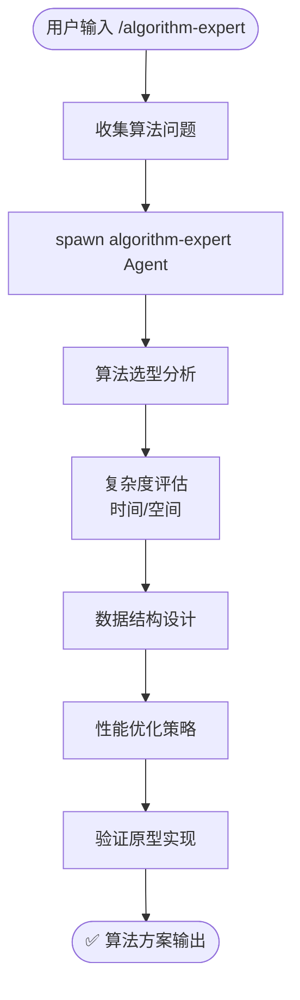

# `/algorithm-expert` — 算法专家流程图

```mermaid
flowchart TD
    START([用户输入 /algorithm-expert]) --> S1[收集算法问题]
    S1 --> S2[spawn algorithm-expert Agent]
    S2 --> S3[算法选型分析]
    S3 --> S4[复杂度评估<br/>时间/空间]
    S4 --> S5[数据结构设计]
    S5 --> S6[性能优化策略]
    S6 --> S7[验证原型实现]
    S7 --> DONE([✅ 算法方案输出])
```
