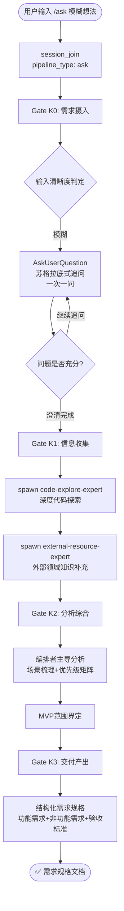
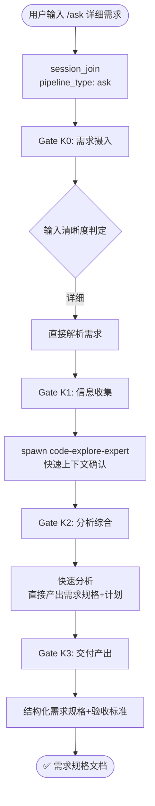
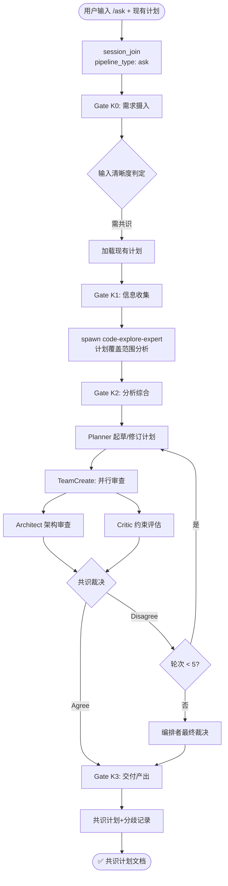
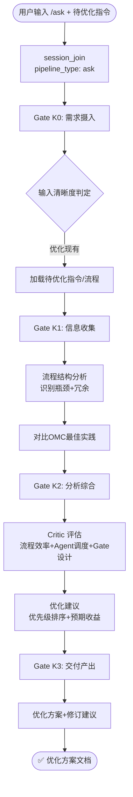

# `/ask` — 需求探询流程图（4 模式）

## Interview 模式（模糊请求）

```mermaid
flowchart TD
    START([用户输入 /ask 模糊想法]) --> JOIN[session_join<br/>pipeline_type: ask]
    JOIN --> K0[Gate K0: 需求摄入]
    K0 --> K0D{输入清晰度判定}
    K0D --> |模糊| K0Q[AskUserQuestion<br/>苏格拉底式追问<br/>一次一问]
    K0Q --> K0E{问题是否充分?}
    K0E --> |继续追问| K0Q
    K0E --> |澄清完成| K1[Gate K1: 信息收集]
    K1 --> K1A[spawn code-explore-expert<br/>深度代码探索]
    K1A --> K1B[spawn external-resource-expert<br/>外部领域知识补充]
    K1B --> K2[Gate K2: 分析综合]
    K2 --> K2A[编排者主导分析<br/>场景梳理+优先级矩阵]
    K2A --> K2B[MVP范围界定]
    K2B --> K3[Gate K3: 交付产出]
    K3 --> K3A[结构化需求规格<br/>功能需求+非功能需求+验收标准]
    K3A --> DONE([✅ 需求规格文档])
```

## Direct 模式（详细请求）

```mermaid
flowchart TD
    START([用户输入 /ask 详细需求]) --> JOIN[session_join<br/>pipeline_type: ask]
    JOIN --> K0[Gate K0: 需求摄入]
    K0 --> K0D{输入清晰度判定}
    K0D --> |详细| K0P[直接解析需求]
    K0P --> K1[Gate K1: 信息收集]
    K1 --> K1A[spawn code-explore-expert<br/>快速上下文确认]
    K1A --> K2[Gate K2: 分析综合]
    K2 --> K2A[快速分析<br/>直接产出需求规格+计划]
    K2A --> K3[Gate K3: 交付产出]
    K3 --> K3A[结构化需求规格+验收标准]
    K3A --> DONE([✅ 需求规格文档])
```

## Consensus 模式（ralplan 共识）

```mermaid
flowchart TD
    START([用户输入 /ask + 现有计划]) --> JOIN[session_join<br/>pipeline_type: ask]
    JOIN --> K0[Gate K0: 需求摄入]
    K0 --> K0D{输入清晰度判定}
    K0D --> |需共识| K0L[加载现有计划]
    K0L --> K1[Gate K1: 信息收集]
    K1 --> K1A[spawn code-explore-expert<br/>计划覆盖范围分析]
    K1A --> K2[Gate K2: 分析综合]
    K2 --> K2P[Planner 起草/修订计划]
    K2P --> K2T[TeamCreate: 并行审查]
    K2T --> K2A[Architect 架构审查]
    K2T --> K2C[Critic 约束评估]
    K2A --> K2R{共识裁决}
    K2C --> K2R
    K2R --> |Disagree| K2L{轮次 < 5?}
    K2L --> |是| K2P
    K2L --> |否| K2F[编排者最终裁决]
    K2R --> |Agree| K3[Gate K3: 交付产出]
    K2F --> K3
    K3 --> K3A[共识计划+分歧记录]
    K3A --> DONE([✅ 共识计划文档])
```

## Review 模式（流程优化）

```mermaid
flowchart TD
    START([用户输入 /ask + 待优化指令]) --> JOIN[session_join<br/>pipeline_type: ask]
    JOIN --> K0[Gate K0: 需求摄入]
    K0 --> K0D{输入清晰度判定}
    K0D --> |优化现有| K0L[加载待优化指令/流程]
    K0L --> K1[Gate K1: 信息收集]
    K1 --> K1A[流程结构分析<br/>识别瓶颈+冗余]
    K1A --> K1B[对比OMC最佳实践]
    K1B --> K2[Gate K2: 分析综合]
    K2 --> K2C[Critic 评估<br/>流程效率+Agent调度+Gate设计]
    K2C --> K2O[优化建议<br/>优先级排序+预期收益]
    K2O --> K3[Gate K3: 交付产出]
    K3 --> K3A[优化方案+修订建议]
    K3A --> DONE([✅ 优化方案文档])
```
