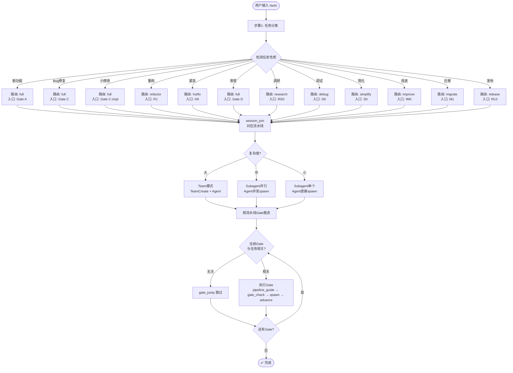

# `/auto` — 智能自动路由流程图

```mermaid
flowchart TD
    START([用户输入 /auto]) --> DETECT[步骤1: 任务分类]
    DETECT --> D1{检测任务性质}
    D1 --> |新功能| FULL[路由: full<br/>入口: Gate A]
    D1 --> |Bug修复| BUG[路由: full<br/>入口: Gate C]
    D1 --> |小修改| SMALL[路由: full<br/>入口: Gate C-impl]
    D1 --> |重构| REF[路由: refactor<br/>入口: R1]
    D1 --> |紧急| HOT[路由: hotfix<br/>入口: H0]
    D1 --> |审查| REV[路由: full<br/>入口: Gate D]
    D1 --> |调研| RES[路由: research<br/>入口: RS0]
    D1 --> |调试| DBG[路由: debug<br/>入口: D0]
    D1 --> |简化| SIM[路由: simplify<br/>入口: S0]
    D1 --> |改进| IMP[路由: improve<br/>入口: IM0]
    D1 --> |迁移| MIG[路由: migrate<br/>入口: M1]
    D1 --> |发布| REL[路由: release<br/>入口: RL0]
    
    FULL --> JOIN[session_join<br/>对应流水线]
    BUG --> JOIN
    SMALL --> JOIN
    REF --> JOIN
    HOT --> JOIN
    REV --> JOIN
    RES --> JOIN
    DBG --> JOIN
    SIM --> JOIN
    IMP --> JOIN
    MIG --> JOIN
    REL --> JOIN
    
    JOIN --> COMPLEX{复杂度?}
    COMPLEX --> |大| TEAM[Team模式<br/>TeamCreate + Agent]
    COMPLEX --> |中| SUB[Subagent并行<br/>Agent并发spawn]
    COMPLEX --> |小| DIRECT[Subagent单个<br/>Agent直接spawn]
    
    TEAM --> EXEC[按流水线Gate推进]
    SUB --> EXEC
    DIRECT --> EXEC
    
    EXEC --> SKIP{当前Gate<br/>与任务相关?}
    SKIP --> |无关| JUMP[gate_jump 跳过]
    SKIP --> |相关| RUN[执行Gate<br/>pipeline_guide → gate_check → spawn → advance]
    
    JUMP --> NEXT{还有Gate?}
    RUN --> NEXT
    NEXT --> |是| SKIP
    NEXT --> |否| DONE([✅ 完成])
```
