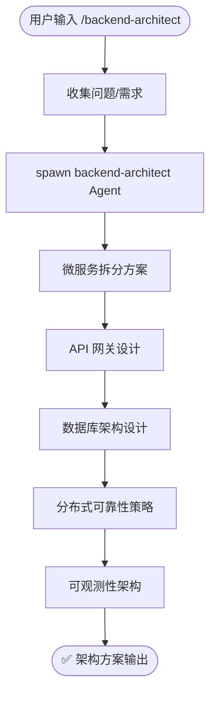

# `/backend-architect` — 后端架构专家流程图

```mermaid
flowchart TD
    START([用户输入 /backend-architect]) --> S1[收集问题/需求]
    S1 --> S2[spawn backend-architect Agent]
    S2 --> S3[微服务拆分方案]
    S3 --> S4[API 网关设计]
    S4 --> S5[数据库架构设计]
    S5 --> S6[分布式可靠性策略]
    S6 --> S7[可观测性架构]
    S7 --> DONE([✅ 架构方案输出])
```
