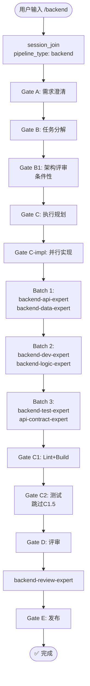

# `/backend` — 后端开发生命周期流程图

```mermaid
flowchart TD
    START([用户输入 /backend]) --> JOIN[session_join<br/>pipeline_type: backend]
    JOIN --> A[Gate A: 需求澄清]
    A --> B[Gate B: 任务分解]
    B --> B1[Gate B1: 架构评审<br/>条件性]
    B1 --> C[Gate C: 执行规划]
    C --> CI[Gate C-impl: 并行实现]
    CI --> CI_B1[Batch 1:<br/>backend-api-expert<br/>backend-data-expert]
    CI_B1 --> CI_B2[Batch 2:<br/>backend-dev-expert<br/>backend-logic-expert]
    CI_B2 --> CI_B3[Batch 3:<br/>backend-test-expert<br/>api-contract-expert]
    CI_B3 --> C1[Gate C1: Lint+Build]
    C1 --> C2[Gate C2: 测试<br/>跳过C1.5]
    C2 --> D[Gate D: 评审]
    D --> D1[backend-review-expert]
    D1 --> E[Gate E: 发布]
    E --> DONE([✅ 完成])
```
