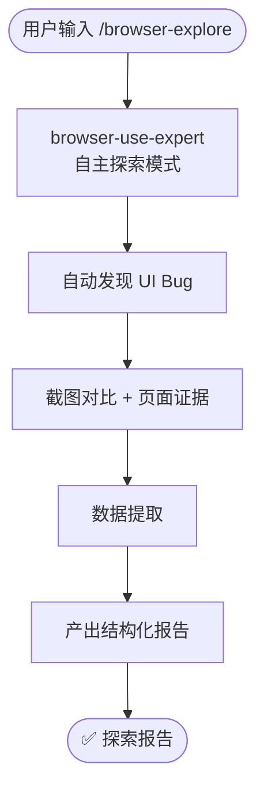

# `/browser-explore` — 浏览器自由探索流程图

```mermaid
flowchart TD
    START([用户输入 /browser-explore]) --> S1[browser-use-expert<br/>自主探索模式]
    S1 --> S2[自动发现 UI Bug]
    S2 --> S3[截图对比 + 页面证据]
    S3 --> S4[数据提取]
    S4 --> S5[产出结构化报告]
    S5 --> DONE([✅ 探索报告])
```
