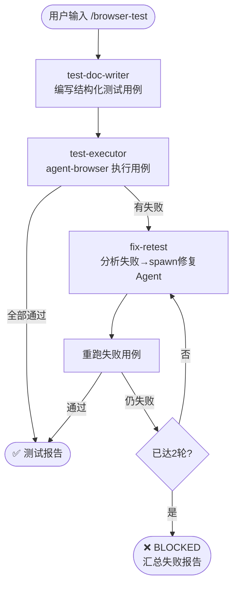

# `/browser-test` — 浏览器探索测试流程图

```mermaid
flowchart TD
    START([用户输入 /browser-test]) --> S1[test-doc-writer<br/>编写结构化测试用例]
    S1 --> S2[test-executor<br/>agent-browser 执行用例]
    S2 --> |全部通过| DONE([✅ 测试报告])
    S2 --> |有失败| S3[fix-retest<br/>分析失败→spawn修复Agent]
    S3 --> S4[重跑失败用例]
    S4 --> |通过| DONE
    S4 --> |仍失败| S5{已达2轮?}
    S5 --> |否| S3
    S5 --> |是| BLOCKED([❌ BLOCKED<br/>汇总失败报告])
```
