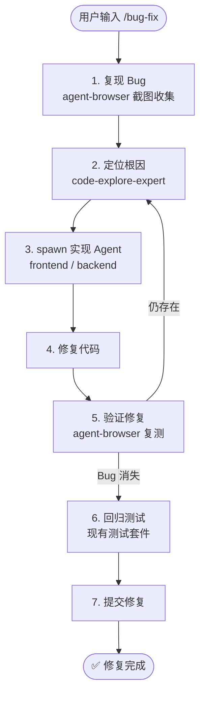

# `/bug-fix` — Bug 修复闭环流程图

```mermaid
flowchart TD
    START([用户输入 /bug-fix]) --> S1[1. 复现 Bug<br/>agent-browser 截图收集]
    S1 --> S2[2. 定位根因<br/>code-explore-expert]
    S2 --> S3[3. spawn 实现 Agent<br/>frontend / backend]
    S3 --> S4[4. 修复代码]
    S4 --> S5[5. 验证修复<br/>agent-browser 复测]
    S5 --> |Bug 消失| S6[6. 回归测试<br/>现有测试套件]
    S6 --> S7[7. 提交修复]
    S7 --> DONE([✅ 修复完成])
    S5 --> |仍存在| S2
```
