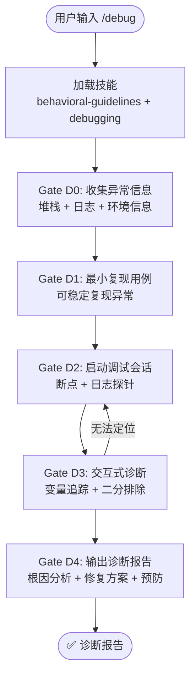

# `/debug` — 调试诊断流程图

```mermaid
flowchart TD
    START([用户输入 /debug]) --> S0[加载技能<br/>behavioral-guidelines + debugging]
    S0 --> D0[Gate D0: 收集异常信息<br/>堆栈 + 日志 + 环境信息]
    D0 --> D1[Gate D1: 最小复现用例<br/>可稳定复现异常]
    D1 --> D2[Gate D2: 启动调试会话<br/>断点 + 日志探针]
    D2 --> D3[Gate D3: 交互式诊断<br/>变量追踪 + 二分排除]
    D3 --> D4[Gate D4: 输出诊断报告<br/>根因分析 + 修复方案 + 预防]
    D4 --> DONE([✅ 诊断报告])
    D3 --> |无法定位| D2
```
