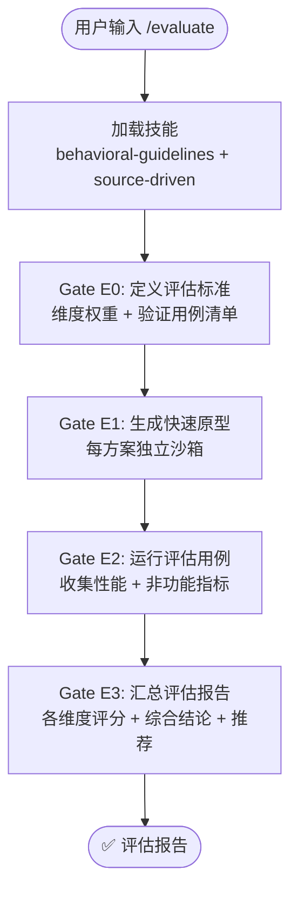

# `/evaluate` — 技术评估流程图

```mermaid
flowchart TD
    START([用户输入 /evaluate]) --> S0[加载技能<br/>behavioral-guidelines + source-driven]
    S0 --> E0[Gate E0: 定义评估标准<br/>维度权重 + 验证用例清单]
    E0 --> E1[Gate E1: 生成快速原型<br/>每方案独立沙箱]
    E1 --> E2[Gate E2: 运行评估用例<br/>收集性能 + 非功能指标]
    E2 --> E3[Gate E3: 汇总评估报告<br/>各维度评分 + 综合结论 + 推荐]
    E3 --> DONE([✅ 评估报告])
```
