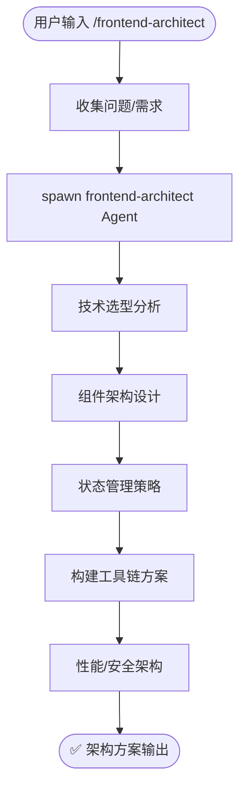

# `/frontend-architect` — 前端架构专家流程图

```mermaid
flowchart TD
    START([用户输入 /frontend-architect]) --> S1[收集问题/需求]
    S1 --> S2[spawn frontend-architect Agent]
    S2 --> S3[技术选型分析]
    S3 --> S4[组件架构设计]
    S4 --> S5[状态管理策略]
    S5 --> S6[构建工具链方案]
    S6 --> S7[性能/安全架构]
    S7 --> DONE([✅ 架构方案输出])
```
