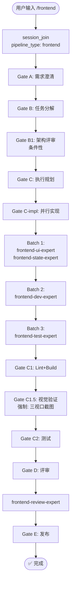

# `/frontend` — 前端开发生命周期流程图

```mermaid
flowchart TD
    START([用户输入 /frontend]) --> JOIN[session_join<br/>pipeline_type: frontend]
    JOIN --> A[Gate A: 需求澄清]
    A --> B[Gate B: 任务分解]
    B --> B1[Gate B1: 架构评审<br/>条件性]
    B1 --> C[Gate C: 执行规划]
    C --> CI[Gate C-impl: 并行实现]
    CI --> CI_B1[Batch 1:<br/>frontend-ui-expert<br/>frontend-state-expert]
    CI_B1 --> CI_B2[Batch 2:<br/>frontend-dev-expert]
    CI_B2 --> CI_B3[Batch 3:<br/>frontend-test-expert]
    CI_B3 --> C1[Gate C1: Lint+Build]
    C1 --> C15[Gate C1.5: 视觉验证<br/>强制: 三视口截图]
    C15 --> C2[Gate C2: 测试]
    C2 --> D[Gate D: 评审]
    D --> D1[frontend-review-expert]
    D1 --> E[Gate E: 发布]
    E --> DONE([✅ 完成])
```
