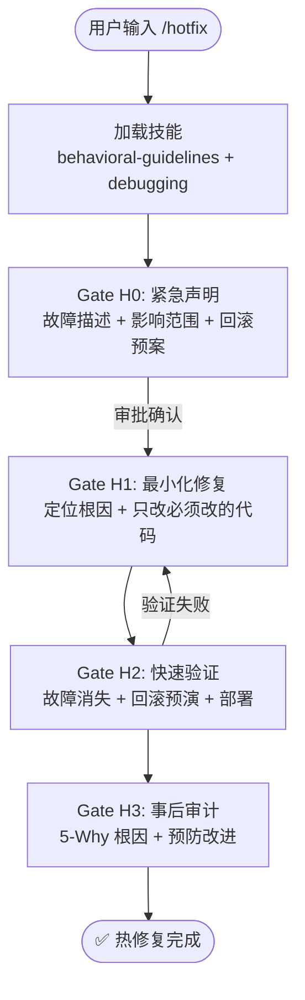

# `/hotfix` — 紧急热修复流程图

```mermaid
flowchart TD
    START([用户输入 /hotfix]) --> S0[加载技能<br/>behavioral-guidelines + debugging]
    S0 --> H0[Gate H0: 紧急声明<br/>故障描述 + 影响范围 + 回滚预案]
    H0 --> |审批确认| H1[Gate H1: 最小化修复<br/>定位根因 + 只改必须改的代码]
    H1 --> H2[Gate H2: 快速验证<br/>故障消失 + 回滚预演 + 部署]
    H2 --> H3[Gate H3: 事后审计<br/>5-Why 根因 + 预防改进]
    H3 --> DONE([✅ 热修复完成])
    H2 --> |验证失败| H1
```
