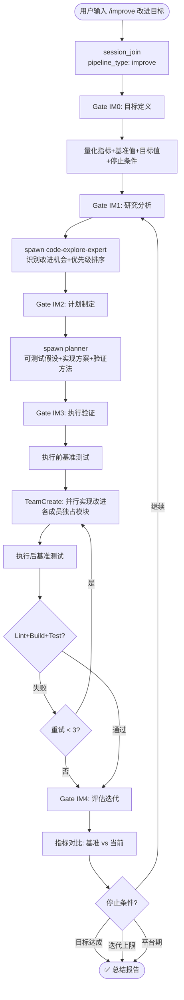

# `/improve` — 自主迭代改进流程图

```mermaid
flowchart TD
    START([用户输入 /improve 改进目标]) --> JOIN[session_join<br/>pipeline_type: improve]
    JOIN --> IM0[Gate IM0: 目标定义]
    IM0 --> IM0A[量化指标+基准值+目标值+停止条件]
    IM0A --> IM1[Gate IM1: 研究分析]
    IM1 --> IM1A[spawn code-explore-expert<br/>识别改进机会+优先级排序]
    IM1A --> IM2[Gate IM2: 计划制定]
    IM2 --> IM2A[spawn planner<br/>可测试假设+实现方案+验证方法]
    IM2A --> IM3[Gate IM3: 执行验证]
    IM3 --> IM3A[执行前基准测试]
    IM3A --> IM3T[TeamCreate: 并行实现改进<br/>各成员独占模块]
    IM3T --> IM3B[执行后基准测试]
    IM3B --> IM3V{Lint+Build+Test?}
    IM3V --> |失败| IM3F{重试 < 3?}
    IM3F --> |是| IM3T
    IM3F --> |否| IM4[Gate IM4: 评估迭代]
    IM3V --> |通过| IM4
    IM4 --> IM4A[指标对比: 基准 vs 当前]
    IM4A --> IM4B{停止条件?}
    IM4B --> |目标达成| DONE([✅ 总结报告])
    IM4B --> |迭代上限| DONE
    IM4B --> |平台期| DONE
    IM4B --> |继续| IM1
```
