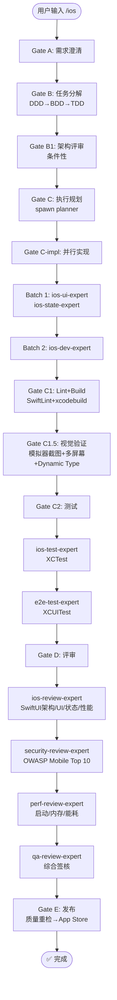

# `/ios` — iOS 开发生命周期流程图

```mermaid
flowchart TD
    START([用户输入 /ios]) --> A[Gate A: 需求澄清]
    A --> B[Gate B: 任务分解<br/>DDD→BDD→TDD]
    B --> B1[Gate B1: 架构评审<br/>条件性]
    B1 --> C[Gate C: 执行规划<br/>spawn planner]
    C --> CI[Gate C-impl: 并行实现]
    CI --> CI1[Batch 1: ios-ui-expert<br/>ios-state-expert]
    CI1 --> CI2[Batch 2: ios-dev-expert]
    CI2 --> C1[Gate C1: Lint+Build<br/>SwiftLint+xcodebuild]
    C1 --> C15[Gate C1.5: 视觉验证<br/>模拟器截图+多屏幕+Dynamic Type]
    C15 --> C2[Gate C2: 测试]
    C2 --> C2A[ios-test-expert<br/>XCTest]
    C2A --> C2B[e2e-test-expert<br/>XCUITest]
    C2B --> D[Gate D: 评审]
    D --> D1[ios-review-expert<br/>SwiftUI架构/UI/状态/性能]
    D1 --> D2[security-review-expert<br/>OWASP Mobile Top 10]
    D2 --> D3[perf-review-expert<br/>启动/内存/能耗]
    D3 --> D4[qa-review-expert<br/>综合签核]
    D4 --> E[Gate E: 发布<br/>质量重检→App Store]
    E --> DONE([✅ 完成])
```
