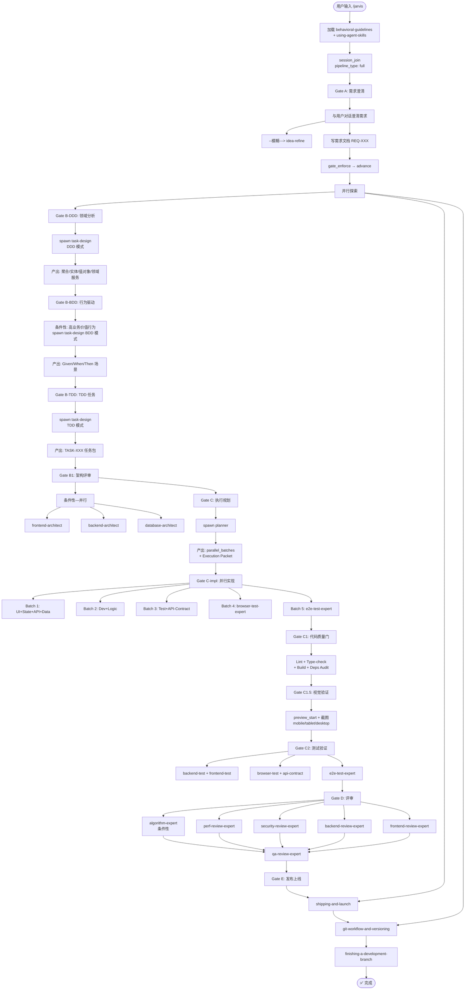

# `/jarvis` — 全流程编排流程图

```mermaid
flowchart TD
    START([用户输入 /jarvis]) --> LOAD[加载 behavioral-guidelines<br/>+ using-agent-skills]
    LOAD --> JOIN[session_join<br/>pipeline_type: full]
    JOIN --> A[Gate A: 需求澄清]
    A --> A1[与用户对话澄清需求]
    A1 --> A2[--模糊---> idea-refine]
    A1 --> A3[写需求文档 REQ-XXX]
    A3 --> A4[gate_enforce → advance]
    
    A4 --> EXP[并行探索]
    EXP --> E1[code-explore-expert ×N]
    EXP --> E2[external-resource-expert ×N]
    
    EXP --> BD[Gate B-DDD: 领域分析]
    BD --> BD1[spawn task-design<br/>DDD 模式]
    BD1 --> BD2[产出: 聚合/实体/值对象/领域服务]
    
    BD2 --> BB[Gate B-BDD: 行为驱动]
    BB --> BB1[条件性: 高业务价值行为<br/>spawn task-design BDD 模式]
    BB1 --> BB2[产出: Given/When/Then 场景]
    
    BB2 --> BT[Gate B-TDD: TDD 任务]
    BT --> BT1[spawn task-design<br/>TDD 模式]
    BT1 --> BT2[产出: TASK-XXX 任务包]
    
    BT2 --> B1[Gate B1: 架构评审]
    B1 --> B1A[条件性—并行]
    B1A --> B1F[frontend-architect]
    B1A --> B1B[backend-architect]
    B1A --> B1D[database-architect]
    
    B1 --> GC[Gate C: 执行规划]
    GC --> GC1[spawn planner]
    GC1 --> GC2[产出: parallel_batches<br/>+ Execution Packet]
    
    GC2 --> CI[Gate C-impl: 并行实现]
    CI --> CI1[Batch 1: UI+State+API+Data]
    CI --> CI2[Batch 2: Dev+Logic]
    CI --> CI3[Batch 3: Test+API-Contract]
    CI --> CI4[Batch 4: browser-test-expert]
    CI --> CI5[Batch 5: e2e-test-expert]
    
    CI5 --> C1[Gate C1: 代码质量门]
    C1 --> C1A[Lint + Type-check<br/>+ Build + Deps Audit]
    
    C1A --> C15[Gate C1.5: 视觉验证]
    C15 --> C15A[preview_start + 截图<br/>mobile/tablet/desktop]
    
    C15A --> C2[Gate C2: 测试验证]
    C2 --> C2A[backend-test + frontend-test]
    C2 --> C2B[browser-test + api-contract]
    C2 --> C2C[e2e-test-expert]
    
    C2C --> D[Gate D: 评审]
    D --> D1[frontend-review-expert]
    D --> D2[backend-review-expert]
    D --> D3[security-review-expert]
    D --> D4[perf-review-expert]
    D --> D5[algorithm-expert<br/>条件性]
    D1 & D2 & D3 & D4 & D5 --> D6[qa-review-expert]
    
    D6 --> E[Gate E: 发布上线]
    E --> E1[shipping-and-launch]
    E1 --> E2[git-workflow-and-versioning]
    E2 --> E3[finishing-a-development-branch]
    E3 --> DONE([✅ 完成])
```
