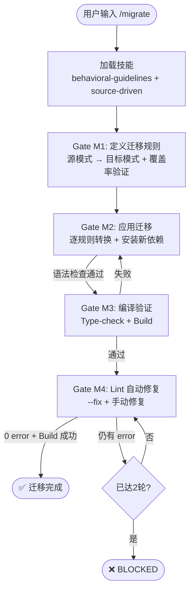

# `/migrate` — 框架迁移流程图

```mermaid
flowchart TD
    START([用户输入 /migrate]) --> S0[加载技能<br/>behavioral-guidelines + source-driven]
    S0 --> M1[Gate M1: 定义迁移规则<br/>源模式 → 目标模式 + 覆盖率验证]
    M1 --> M2[Gate M2: 应用迁移<br/>逐规则转换 + 安装新依赖]
    M2 --> |语法检查通过| M3[Gate M3: 编译验证<br/>Type-check + Build]
    M3 --> |通过| M4[Gate M4: Lint 自动修复<br/>--fix + 手动修复]
    M3 --> |失败| M2
    M4 --> |0 error + Build 成功| DONE([✅ 迁移完成])
    M4 --> |仍有 error| RETRY{已达2轮?}
    RETRY --> |否| M4
    RETRY --> |是| BLOCKED([❌ BLOCKED])
```
