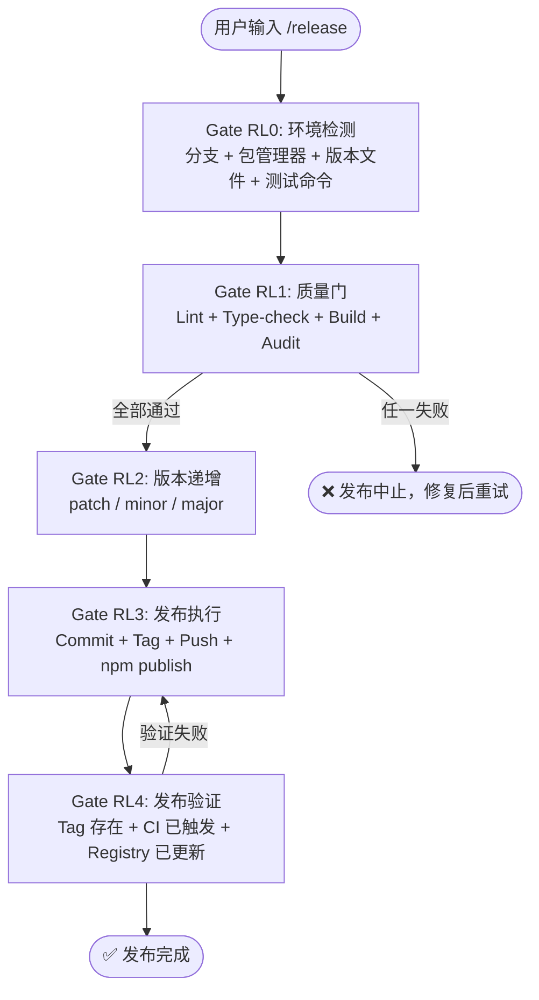

# `/release` — 版本发布流程图

```mermaid
flowchart TD
    START([用户输入 /release]) --> RL0[Gate RL0: 环境检测<br/>分支 + 包管理器 + 版本文件 + 测试命令]
    RL0 --> RL1[Gate RL1: 质量门<br/>Lint + Type-check + Build + Audit]
    RL1 --> |全部通过| RL2[Gate RL2: 版本递增<br/>patch / minor / major]
    RL1 --> |任一失败| FAIL([❌ 发布中止，修复后重试])
    RL2 --> RL3[Gate RL3: 发布执行<br/>Commit + Tag + Push + npm publish]
    RL3 --> RL4[Gate RL4: 发布验证<br/>Tag 存在 + CI 已触发 + Registry 已更新]
    RL4 --> DONE([✅ 发布完成])
    RL4 --> |验证失败| RL3
```
