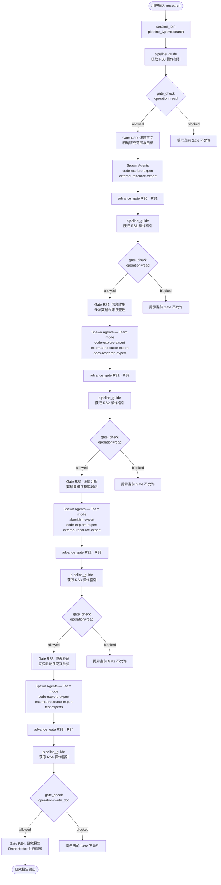

# `/research` — 深度研究流程图

```mermaid
flowchart TD
    START([用户输入 /research]) --> JOIN[session_join<br/>pipeline_type=research]
    JOIN --> GUIDE0[pipeline_guide<br/>获取 RS0 操作指引]
    GUIDE0 --> GC0{gate_check<br/>operation=read}
    GC0 -->|allowed| RS0[Gate RS0: 课题定义<br/>明确研究范围与目标]
    GC0 -->|blocked| STOP0[提示当前 Gate 不允许]

    RS0 --> SPAWN0[Spawn Agents<br/>code-explore-expert<br/>external-resource-expert]
    SPAWN0 --> ADV0[advance_gate RS0→RS1]

    ADV0 --> GUIDE1[pipeline_guide<br/>获取 RS1 操作指引]
    GUIDE1 --> GC1{gate_check<br/>operation=read}
    GC1 -->|allowed| RS1[Gate RS1: 信息收集<br/>多源数据采集与整理]
    GC1 -->|blocked| STOP1[提示当前 Gate 不允许]

    RS1 --> SPAWN1[Spawn Agents — Team mode<br/>code-explore-expert<br/>external-resource-expert<br/>docs-research-expert]
    SPAWN1 --> ADV1[advance_gate RS1→RS2]

    ADV1 --> GUIDE2[pipeline_guide<br/>获取 RS2 操作指引]
    GUIDE2 --> GC2{gate_check<br/>operation=read}
    GC2 -->|allowed| RS2[Gate RS2: 深度分析<br/>数据关联与模式识别]
    GC2 -->|blocked| STOP2[提示当前 Gate 不允许]

    RS2 --> SPAWN2[Spawn Agents — Team mode<br/>algorithm-expert<br/>code-explore-expert<br/>external-resource-expert]
    SPAWN2 --> ADV2[advance_gate RS2→RS3]

    ADV2 --> GUIDE3[pipeline_guide<br/>获取 RS3 操作指引]
    GUIDE3 --> GC3{gate_check<br/>operation=read}
    GC3 -->|allowed| RS3[Gate RS3: 假设验证<br/>实验验证与交叉检验]
    GC3 -->|blocked| STOP3[提示当前 Gate 不允许]

    RS3 --> SPAWN3[Spawn Agents — Team mode<br/>code-explore-expert<br/>external-resource-expert<br/>test experts]
    SPAWN3 --> ADV3[advance_gate RS3→RS4]

    ADV3 --> GUIDE4[pipeline_guide<br/>获取 RS4 操作指引]
    GUIDE4 --> GC4{gate_check<br/>operation=write_doc}
    GC4 -->|allowed| RS4[Gate RS4: 研究报告<br/>Orchestrator 汇总输出]
    GC4 -->|blocked| STOP4[提示当前 Gate 不允许]

    RS4 --> DONE([研究报告输出])
```
