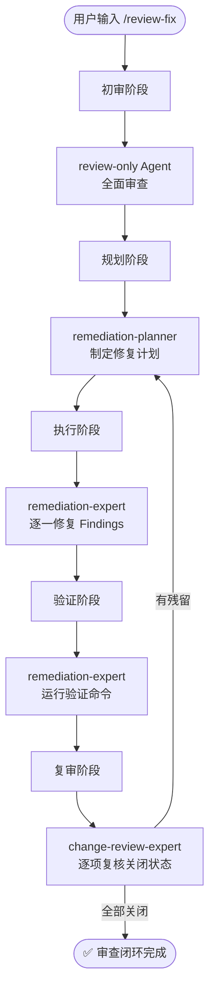

# `/review-fix` — 审查修复优化闭环流程图

```mermaid
flowchart TD
    START([用户输入 /review-fix]) --> S1[初审阶段]
    S1 --> S1A[review-only Agent<br/>全面审查]
    S1A --> S2[规划阶段]
    S2 --> S2A[remediation-planner<br/>制定修复计划]
    S2A --> S3[执行阶段]
    S3 --> S3A[remediation-expert<br/>逐一修复 Findings]
    S3A --> S4[验证阶段]
    S4 --> S4A[remediation-expert<br/>运行验证命令]
    S4A --> S5[复审阶段]
    S5 --> S5A[change-review-expert<br/>逐项复核关闭状态]
    S5A --> |全部关闭| DONE([✅ 审查闭环完成])
    S5A --> |有残留| S2A
```
