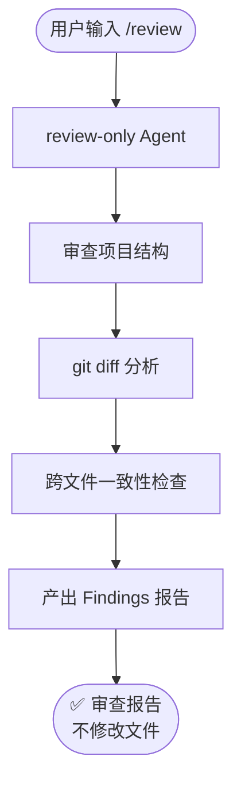

# `/review` — 只读审查模式流程图

```mermaid
flowchart TD
    START([用户输入 /review]) --> S1[review-only Agent]
    S1 --> S2[审查项目结构]
    S2 --> S3[git diff 分析]
    S3 --> S4[跨文件一致性检查]
    S4 --> S5[产出 Findings 报告]
    S5 --> DONE([✅ 审查报告<br/>不修改文件])
```
