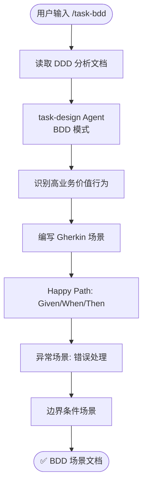

# `/task-bdd` — BDD 行为驱动流程图

```mermaid
flowchart TD
    START([用户输入 /task-bdd]) --> S1[读取 DDD 分析文档]
    S1 --> S2[task-design Agent<br/>BDD 模式]
    S2 --> S3[识别高业务价值行为]
    S3 --> S4[编写 Gherkin 场景]
    S4 --> S5[Happy Path: Given/When/Then]
    S5 --> S6[异常场景: 错误处理]
    S6 --> S7[边界条件场景]
    S7 --> DONE([✅ BDD 场景文档])
```
