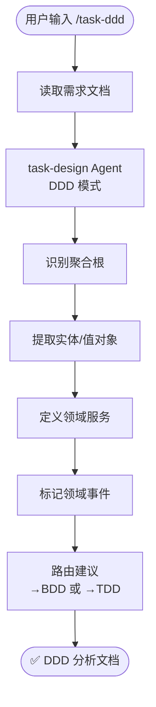

# `/task-ddd` — DDD 领域驱动分析流程图

```mermaid
flowchart TD
    START([用户输入 /task-ddd]) --> S1[读取需求文档]
    S1 --> S2[task-design Agent<br/>DDD 模式]
    S2 --> S3[识别聚合根]
    S3 --> S4[提取实体/值对象]
    S4 --> S5[定义领域服务]
    S5 --> S6[标记领域事件]
    S6 --> S7[路由建议<br/>→BDD 或 →TDD]
    S7 --> DONE([✅ DDD 分析文档])
```
