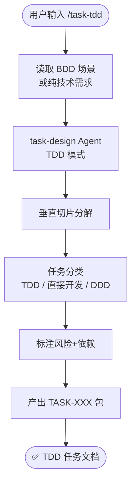

# `/task-tdd` — TDD 测试驱动任务流程图

```mermaid
flowchart TD
    START([用户输入 /task-tdd]) --> S1[读取 BDD 场景<br/>或纯技术需求]
    S1 --> S2[task-design Agent<br/>TDD 模式]
    S2 --> S3[垂直切片分解]
    S3 --> S4[任务分类<br/>TDD / 直接开发 / DDD]
    S4 --> S5[标注风险+依赖]
    S5 --> S6[产出 TASK-XXX 包]
    S6 --> DONE([✅ TDD 任务文档])
```
