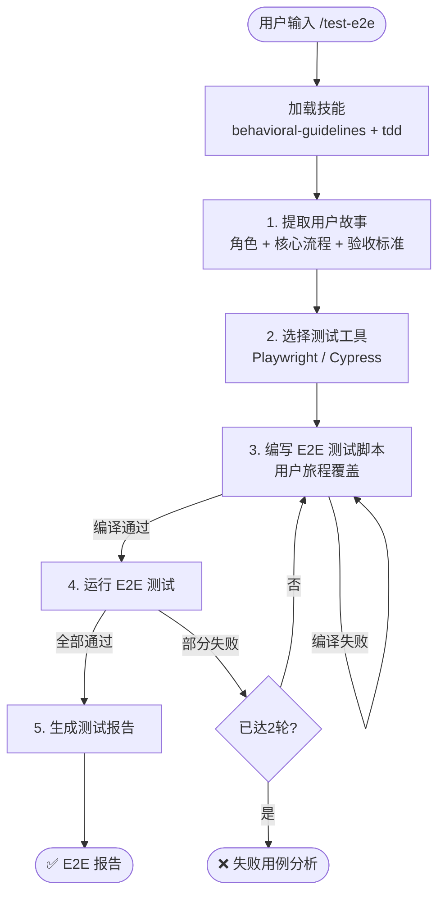

# `/test-e2e` — 端到端测试流程图

```mermaid
flowchart TD
    START([用户输入 /test-e2e]) --> S0[加载技能<br/>behavioral-guidelines + tdd]
    S0 --> S1[1. 提取用户故事<br/>角色 + 核心流程 + 验收标准]
    S1 --> S2[2. 选择测试工具<br/>Playwright / Cypress]
    S2 --> S3[3. 编写 E2E 测试脚本<br/>用户旅程覆盖]
    S3 --> |编译通过| S4[4. 运行 E2E 测试]
    S3 --> |编译失败| S3
    S4 --> |全部通过| S5[5. 生成测试报告]
    S5 --> DONE([✅ E2E 报告])
    S4 --> |部分失败| S6{已达2轮?}
    S6 --> |否| S3
    S6 --> |是| FAIL([❌ 失败用例分析])
```
