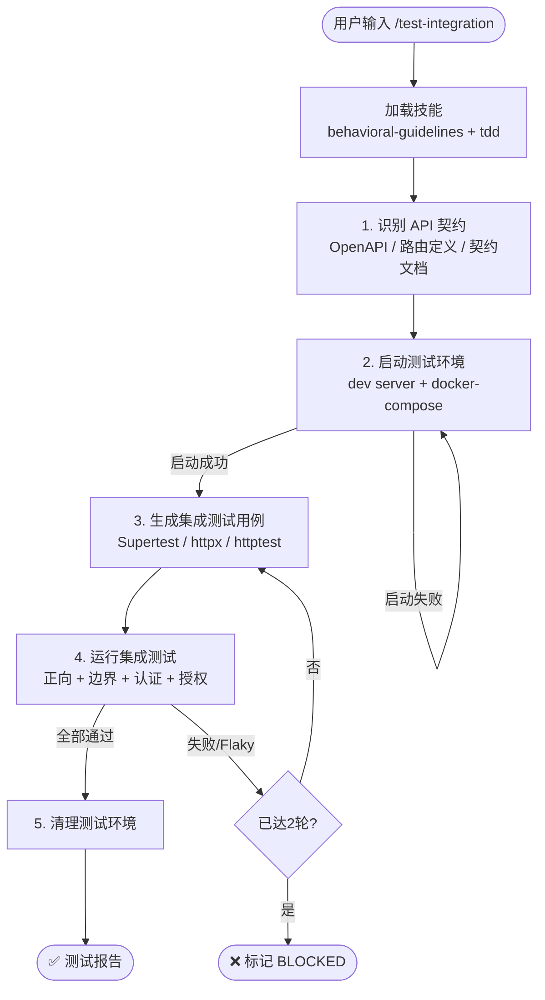

# `/test-integration` — 集成测试 / API 测试流程图

```mermaid
flowchart TD
    START([用户输入 /test-integration]) --> S0[加载技能<br/>behavioral-guidelines + tdd]
    S0 --> S1[1. 识别 API 契约<br/>OpenAPI / 路由定义 / 契约文档]
    S1 --> S2[2. 启动测试环境<br/>dev server + docker-compose]
    S2 --> |启动成功| S3[3. 生成集成测试用例<br/>Supertest / httpx / httptest]
    S2 --> |启动失败| S2
    S3 --> S4[4. 运行集成测试<br/>正向 + 边界 + 认证 + 授权]
    S4 --> |全部通过| S5[5. 清理测试环境]
    S5 --> DONE([✅ 测试报告])
    S4 --> |失败/Flaky| S6{已达2轮?}
    S6 --> |否| S3
    S6 --> |是| FAIL([❌ 标记 BLOCKED])
```
