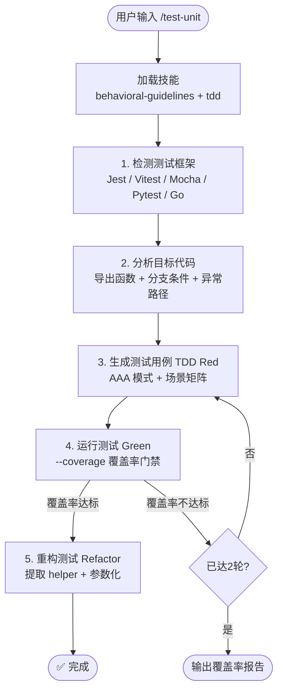

# `/test-unit` — 单元测试生成与执行流程图

```mermaid
flowchart TD
    START([用户输入 /test-unit]) --> S0[加载技能<br/>behavioral-guidelines + tdd]
    S0 --> S1[1. 检测测试框架<br/>Jest / Vitest / Mocha / Pytest / Go]
    S1 --> S2[2. 分析目标代码<br/>导出函数 + 分支条件 + 异常路径]
    S2 --> S3[3. 生成测试用例 TDD Red<br/>AAA 模式 + 场景矩阵]
    S3 --> S4[4. 运行测试 Green<br/>--coverage 覆盖率门禁]
    S4 --> |覆盖率达标| S5[5. 重构测试 Refactor<br/>提取 helper + 参数化]
    S5 --> DONE([✅ 完成])
    S4 --> |覆盖率不达标| S6{已达2轮?}
    S6 --> |否| S3
    S6 --> |是| REPORT([输出覆盖率报告])
```
