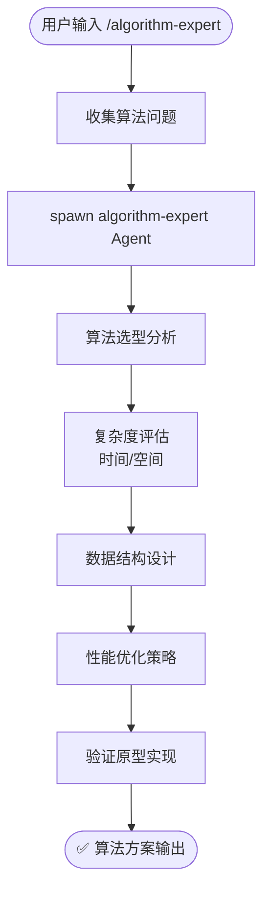

# `/algorithm-expert` — 算法专家分析

- **命令**：`/algorithm-expert [问题描述]`
- **类别**：技术咨询
- **说明**：启动算法专家 Agent，对算法问题进行系统性分析。涵盖算法选型、时间/空间复杂度评估、数据结构设计、性能优化策略，并输出可验证的原型实现方案。

## 使用场景

| 场景 | 说明 |
|------|------|
| 算法选型 | 针对具体问题对比候选算法，推荐最优方案 |
| 复杂度分析 | 评估算法的时间复杂度和空间复杂度，识别性能瓶颈 |
| 数据结构设计 | 为特定场景设计或选择合适的数据结构 |
| 性能优化 | 分析现有实现的性能问题，提供优化策略和重构建议 |

## 关键 Agent

| Agent | 职责 |
|-------|------|
| algorithm-expert | 分析算法问题，完成选型、复杂度评估、数据结构设计和优化方案输出 |

## 流程图

