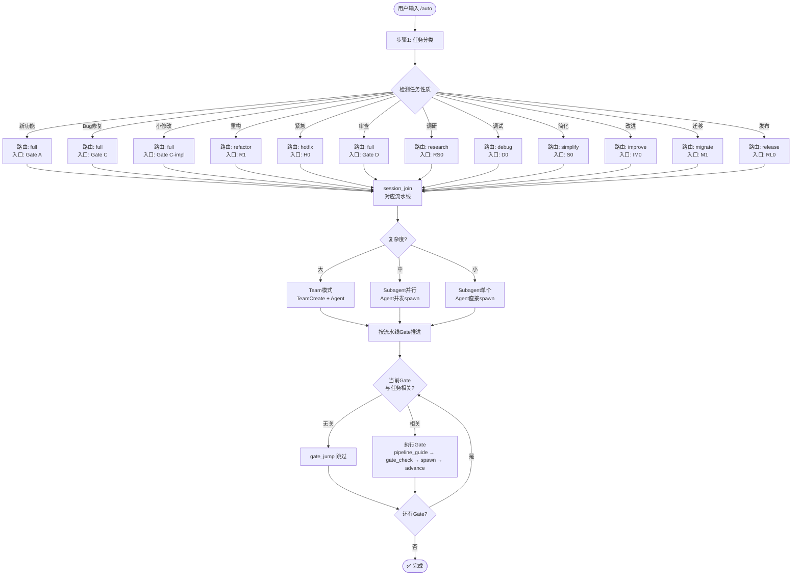

# `/auto` — 智能自动路由流程图

- **命令**：`/auto [任务描述]`
- **类别**：编排入口
- **说明**：智能自动路由——检测 12 种任务类型 → 路由最优流水线 → 跳过无关 Gate → 按复杂度分配 Team/Subagent。99% 的情况用它就够了。

## 使用场景

| 场景 | 路由 | 说明 |
|------|------|------|
| 新功能开发 | full (Gate A) | 全流程严格模式 |
| Bug 修复 | full (Gate C) | 跳过需求分析，直接修复 |
| 紧急修复 | hotfix (H0) | 快速热修复流水线 |
| 代码审查 | full (Gate D) | 直接进入评审 Gate |
| 技术调研 | research (RS0) | 深度研究流水线 |
| 调试问题 | debug (D0) | 调试诊断流水线 |

## 关键 Agent

`/auto` 按检测结果动态路由，不固定 Agent。路由后调用对应流水线的 Agent 集合——小任务 subagent、中任务 Team 2-3、大任务 Team 4-6。

