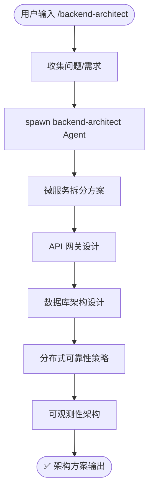

# `/backend-architect` — 后端架构评审

- **命令**：`/backend-architect [架构需求描述]`
- **类别**：架构
- **说明**：对后端系统进行架构评审，输出微服务拆分、API 网关设计、数据库架构及分布式可靠性策略等完整方案。

## 使用场景

| 场景 | 说明 |
|------|------|
| 微服务拆分评估 | 将单体应用拆分为微服务时，评估服务边界、通信方式和数据一致性方案 |
| 数据库架构设计 | 新项目或重构时，选型数据库引擎、设计分库分表与读写分离策略 |
| API 网关规划 | 设计统一入口、鉴权限流、路由规则与版本管理策略 |
| 分布式可靠性保障 | 制定熔断降级、重试补偿、幂等设计与容灾方案 |
| 可观测性体系建设 | 规划日志、指标、链路追踪三大支柱的采集与告警方案 |

## 关键 Agent

| Agent | 职责 |
|-------|------|
| `backend-architect` | 后端架构整体方案设计，包括服务拆分、接口定义与技术选型 |
| `database-architect` | 数据库架构设计，包括数据模型、索引策略与扩展方案 |

## 流程图

