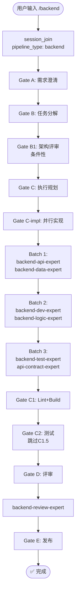

# `/backend` — 后端开发生命周期

- **命令**：`/backend [需求描述]`
- **类别**：开发流程
- **说明**：后端开发全生命周期流程，从需求澄清到发布上线，涵盖架构评审、并行实现、测试验证和代码评审各阶段。

## 使用场景
| 场景 | 说明 |
|------|------|
| 新建后端功能 | 从零构建 API、数据模型、业务逻辑等后端模块 |
| 后端模块扩展 | 在现有后端架构上增加新接口或数据处理能力 |
| 数据库变更 | 涉及 Schema 迁移、索引优化、数据管道改造 |
| 后端整体交付 | 需要完整走完架构→实现→测试→评审→发布流程 |

## 关键 Agent
| Agent | 职责 |
|-------|------|
| backend-architect | 后端架构设计与技术选型 |
| database-architect | 数据库 Schema 设计与迁移方案 |
| backend-dev-expert | 后端核心业务代码实现 |
| backend-api-expert | API 接口设计与实现 |
| backend-logic-expert | 复杂业务逻辑实现 |
| backend-data-expert | 数据处理与持久化层实现 |
| backend-test-expert | 后端单元测试与集成测试 |
| backend-review-expert | 后端代码质量评审 |

## 流程图

