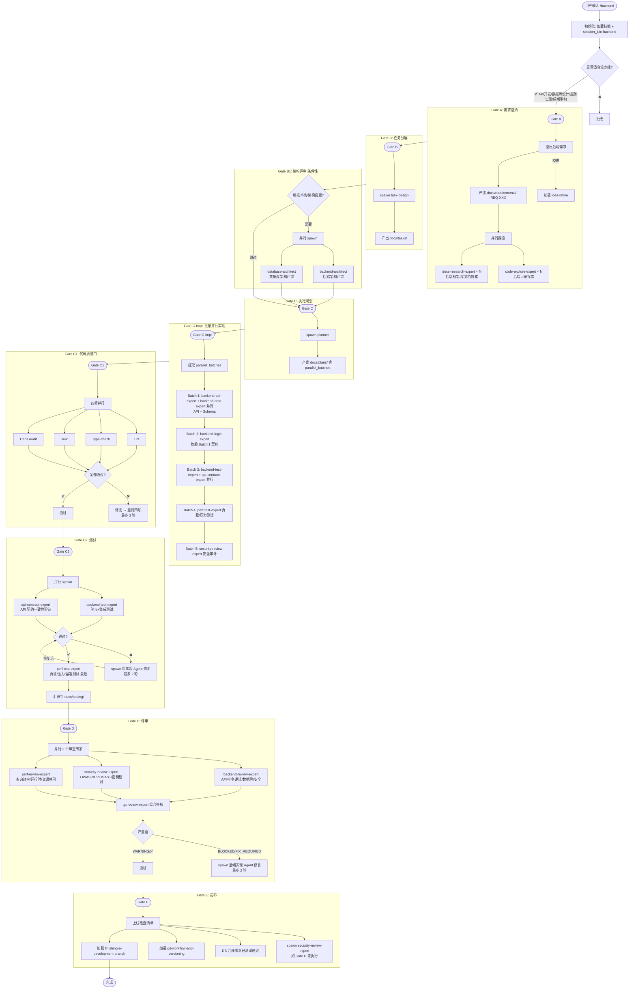

# `/backend` 后端开发生命周期流程图

> **pipeline_type**: `backend`  
> **Gate 序列**: A → B → B1 → C → C-impl → C1 → C2 → D → E (**9 道闸门, 跳过 C1.5**)

**可用 Agent 路由：**

| 层级 | subagent_type |
|------|--------------|
| 架构设计 | backend-architect / database-architect |
| 全栈实现 | backend-dev-expert |
| API/路由/中间件 | backend-api-expert |
| 业务逻辑/领域 | backend-logic-expert |
| 数据层/Schema/迁移 | backend-data-expert |
| 后端测试 | backend-test-expert |
| 性能/负载测试 | perf-test-expert |
| API 文档 | api-contract-expert |
