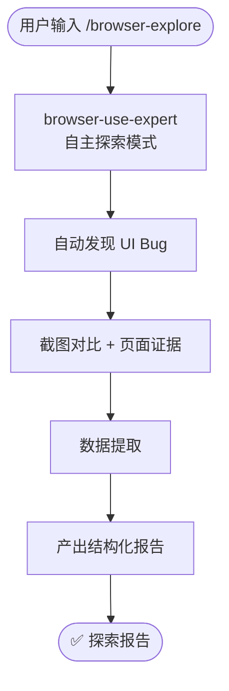

# `/browser-explore` — 浏览器探索模式

- **命令**：`/browser-explore [探索目标或 URL]`
- **类别**：调研
- **说明**：以自主探索模式驱动浏览器，自动发现 UI Bug、提取页面数据并产出结构化报告。

## 使用场景

| 场景 | 说明 |
|------|------|
| UI Bug 扫描 | 自主遍历页面，发现布局异常、交互缺陷与视觉回归问题 |
| 竞品数据提取 | 访问竞品网站，提取定价、功能列表等结构化数据 |
| 页面行为分析 | 截图对比与交互记录，分析页面加载、动画与响应行为 |
| 新功能探索 | 对新上线页面进行无脚本自由探索，生成可用性报告 |

## 关键 Agent

| Agent | 职责 |
|-------|------|
| `browser-use-expert` | 浏览器自主探索，包括页面导航、元素交互与数据提取 |

## 流程图

