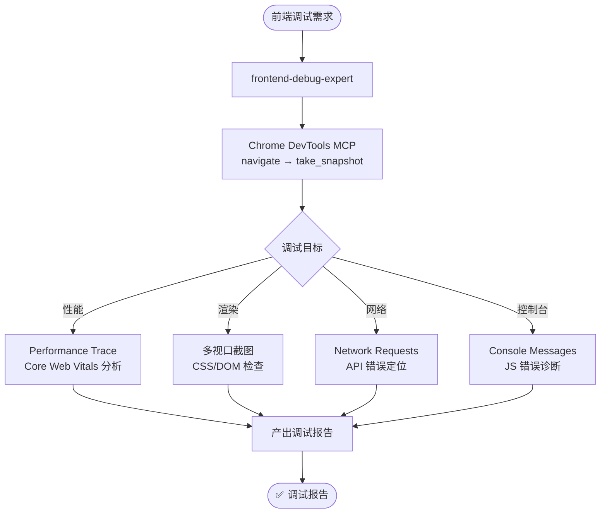

# 前端调试探索

- **类别**：调试
- **说明**：使用 Chrome DevTools MCP 进行前端深度调试——性能分析、渲染诊断、网络检查、控制台诊断。

## 使用场景

| 场景 | 说明 |
|------|------|
| 性能分析 | Core Web Vitals (LCP/FID/CLS)、渲染性能、内存泄漏检测 |
| 渲染调试 | 布局问题、样式层叠、重绘/回流诊断 |
| 网络诊断 | HTTP 请求/响应分析、API 错误定位、资源加载优化 |
| 控制台诊断 | JS 运行时错误、未捕获异常、console 日志分析 |
| 跨端调试 | PC / Tablet / Mobile 多视口验证 |
| 打包后调试 | 构建产物性能分析、内联资源验证 |

## 关键 Agent

| Agent | 职责 |
|-------|------|
| `frontend-debug-expert` | Chrome DevTools MCP 深度调试——性能追踪 + 渲染分析 + 网络诊断 |

## 流程图

