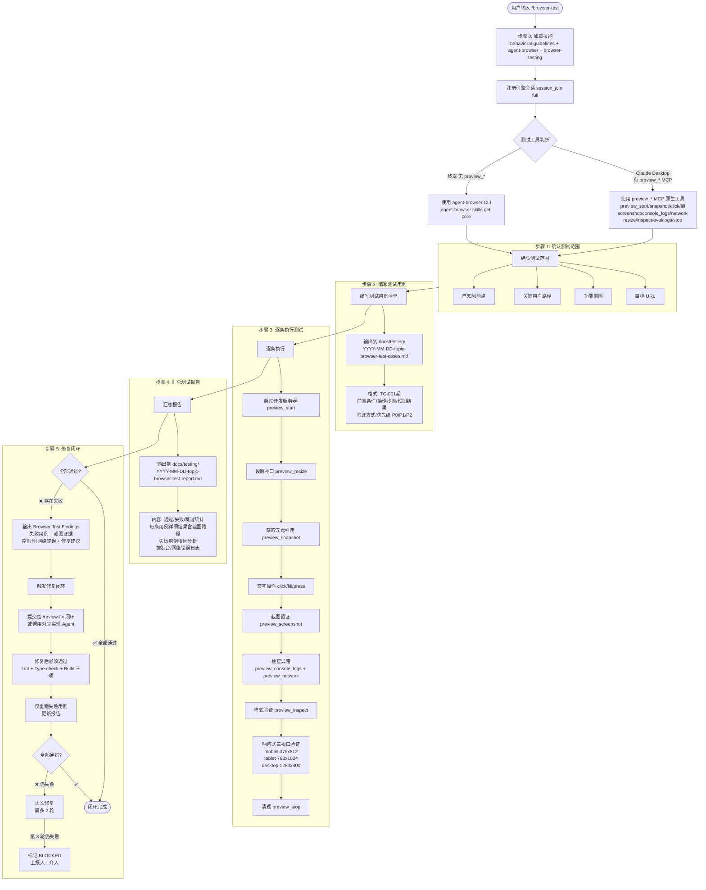

# `/browser-test` 浏览器自动化测试闭环流程图

> **模式**: 文档驱动测试闭环 —— 先写用例，再操作浏览器执行，记录结果，失败则驱动修复重测

**测试工具选择逻辑：**

| 环境 | 工具 | 说明 |
|------|------|------|
| Claude Desktop | preview_* MCP | 原生内置，无需浏览器扩展 |
| 终端 | agent-browser CLI | 命令行操作浏览器 |
| 需登录态 | agent-browser --profile "Default" | 复用 Chrome 登录状态 |

**红线：**
- 禁止使用 Claude in Chrome 扩展
- 不写用例直接操作浏览器
- 测试失败不截图
- 跳过修复闭环
- 破坏性操作（删除数据/发起支付）
- 硬等待替代轮询确认
