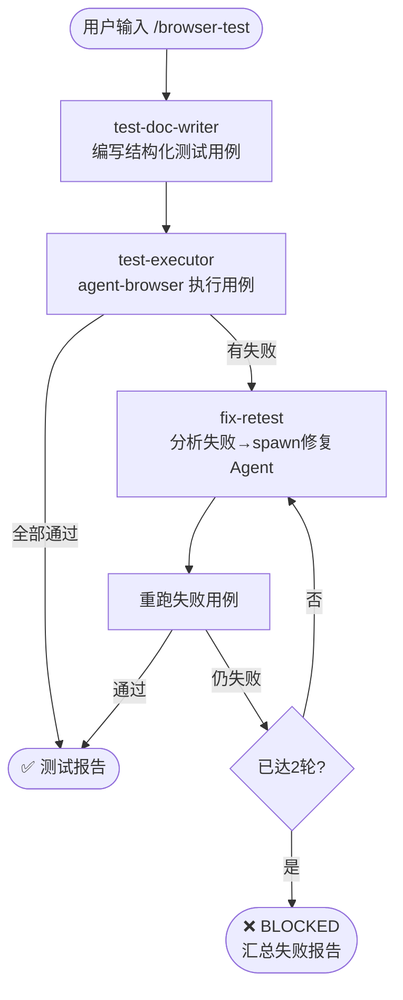

# `/browser-test` — 浏览器自动化测试

- **命令**：`/browser-test [测试目标描述]`
- **类别**：测试
- **说明**：通过浏览器自动化执行结构化测试用例，自动发现 UI 问题并生成测试报告，支持失败重试与修复闭环。

## 使用场景

| 场景 | 说明 |
|------|------|
| E2E 功能测试 | 对关键用户流程（注册、登录、下单等）进行端到端自动化验证 |
| 回归测试 | 版本发布前，自动回归验证核心功能未被破坏 |
| UI 兼容性测试 | 在不同浏览器或视窗尺寸下验证页面渲染与交互一致性 |
| Bug 修复验证 | 修复后自动重跑失败用例，确认 Bug 已消解 |

## 关键 Agent

| Agent | 职责 |
|-------|------|
| `browser-test-expert` | 浏览器自动化测试执行，包括用例编写、执行与结果分析 |

## 流程图

