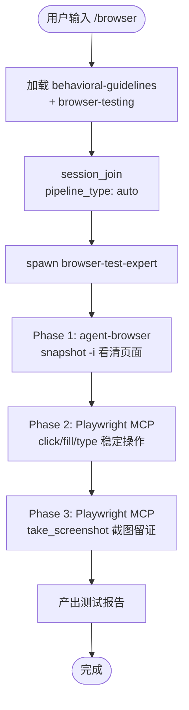

# `/browser` — 浏览器交互测试

- **命令**：`/browser [URL 或功能描述]`
- **类别**：技术咨询
- **说明**：浏览器交互测试——agent-browser + Playwright MCP 混合模式："精确获取 + 稳定执行"。agent-browser 低成本看清页面，Playwright MCP 稳定执行操作。

## 使用场景

| 场景 | 说明 |
|------|------|
| 页面交互验证 | 按测试用例逐条执行页面交互验证 |
| Bug 复现 | 浏览器复现 Bug，截图/控制台/网络证据收集 |
| 响应式检查 | 多视口（mobile/tablet/desktop）页面验证 |
| 本地 Web 面板检查 | 探索 Jarvis 引擎 Web 面板 (127.0.0.1:3456) |

## 流程步骤

1. **加载技能 + 注册引擎**：`Skill("behavioral-guidelines")` + `Skill("browser-testing")` + `session_join(pipeline_type: "auto")`
2. **spawn browser-test-expert**：agent-browser snapshot 看清页面 → Playwright MCP 稳定操作 → 截图验证
3. **产出报告**：测试通过/失败报告（附截图证据）

## 混合模式精髓

```
Phase 1 (看清): agent-browser snapshot -i → 低成本获取页面 @ref
Phase 2 (操作): Playwright MCP browser_click/fill/type → 稳定执行
Phase 3 (验证): Playwright MCP browser_take_screenshot → 截图留证
```

## 关键 Agent

| Agent | 职责 |
|-------|------|
| browser-test-expert | agent-browser + Playwright MCP 混合，交互式页面验证 |
| frontend-debug-expert | Chrome DevTools MCP 深度调试（性能/渲染/网络） |

> 若需修复已知 Bug 并用浏览器复现，请使用 `/bug-fix`。


