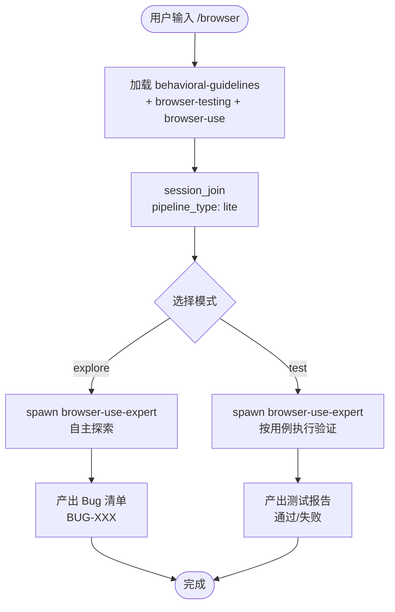

# `/browser` — 浏览器自动化测试

- **命令**：`/browser [--mode explore|test] [URL 或功能描述]`
- **类别**：技术咨询
- **说明**：浏览器自动化——自主探索发现 Bug 或按测试用例逐条执行验证。默认探索本地 Web 面板 (127.0.0.1:3456)。

## 使用场景

| 场景 | 模式 | 说明 |
|------|------|------|
| UI 自主探索测试 | `explore` | browser-use 自主浏览，自动发现 UI Bug |
| 结构化验收测试 | `test` | 按预先编写的测试用例逐条执行验证 |
| 本地 Web 面板检查 | (默认) | 探索 Jarvis 引擎 Web 面板 (127.0.0.1:3456) |
| 外部站点测试 | URL 参数 | 传外部 URL 进行探索或测试 |

## 流程步骤

1. **加载技能 + 注册引擎**：`Skill("behavioral-guidelines")` + `Skill("browser-testing")` + `Skill("browser-use")` + `session_join(pipeline_type: "lite")`
2. **模式选择**：explore（自主探索）或 test（结构化测试）
3. **执行浏览器操作**：spawn `browser-use-expert` 进行自主浏览或按用例执行
4. **产出报告**：BUG-XXX 清单（explore 模式）或测试通过/失败报告（test 模式）

## 关键 Agent

| Agent | 职责 |
|-------|------|
| browser-use-expert | 浏览器自动化操作与 Bug 发现 |

> 若需修复已知 Bug 并用浏览器复现，请使用 `/bug-fix`。

