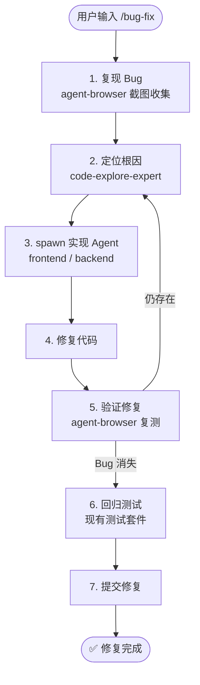

# `/bug-fix` — Bug 修复闭环

- **命令**：`/bug-fix [Bug 描述或截图]`
- **类别**：维护流程
- **说明**：Bug 修复闭环流程，从复现、定位根因到修复验证，支持浏览器截图辅助复现，确保修复后回归测试通过。

## 使用场景
| 场景 | 说明 |
|------|------|
| 功能 Bug 修复 | 某功能行为不符合预期，需要定位并修复 |
| UI 显示异常 | 页面渲染、布局、样式等问题，需截图辅助复现 |
| 接口返回错误 | API 返回数据异常或状态码错误 |
| 跨模块交互问题 | 多模块协作导致的边界 Bug |

## 关键 Agent
| Agent | 职责 |
|-------|------|
| code-explore-expert | 代码探索与根因定位 |
| frontend-dev-expert | 前端相关 Bug 修复实现（按需） |
| backend-dev-expert | 后端相关 Bug 修复实现（按需） |
| browser-test-expert | 浏览器端复现与修复验证 |

## 流程图

