# `/bug-fix` Bug 修复闭环流程图

> **模式**: 浏览器复现 → 定位根因 → 修复 → 浏览器验证完整闭环

```mermaid
flowchart TD
    Start([用户输入 /bug-fix]) --> Init[步骤 0: 加载技能<br/>behavioral-guidelines + agent-browser + browser-testing]
    Init --> Session[注册引擎会话 session_join full]
    Session --> BugReport

    subgraph S1[步骤 1: 收集 Bug 信息]
        BugReport[收集 Bug 信息] --> S1A[Bug 描述: 预期 vs 实际]
        S1A --> S1B[影响页面/URL]
        S1B --> S1C[复现步骤]
        S1C --> S1D[环境信息: 浏览器/设备/登录状态]
        S1D --> S1E[严重程度: P0/P1/P2]
        S1E --> ConfirmReport[输出 Bug Report 摘要<br/>等待用户确认]
    end

    ConfirmReport --> Step2

    subgraph S2[步骤 2: 浏览器复现]
        Step2[浏览器复现 捕获证据] --> S2Init[agent-browser open URL]
        S2Init --> S2Repro[按复现步骤逐步操作]
        S2Repro --> S2Snapshot[每步 snapshot -i 确认页面状态]
        S2Snapshot --> S2Anomaly{异常发生?}
        S2Anomaly -->|是| S2Evidence[截图 bug-repro.png<br/>agent-browser console<br/>agent-browser errors<br/>agent-browser network requests]
        S2Anomaly -->|否| S2Boundary[边界探测 至少 1 个变体]
        S2Boundary --> S2Anomaly
        S2Anomaly -->|2 轮仍无法复现| S2Fail[回问用户补充条件]
        S2Evidence --> Step3
    end

    Step2 --> Step3

    subgraph S3[步骤 3: 定位根因]
        Step3[定位根因] --> S3Source[从页面反查代码<br/>定位前端组件文件]
        S3Source --> S3Flow[追踪数据流<br/>状态管理/API调用/数据处理]
        S3Flow --> S3Boundary[检查边界条件<br/>空值/未定义/异常数据/竞态]
        S3Boundary --> RootCause[输出 Root Cause Analysis<br/>故障文件:行号<br/>故障类型<br/>直接原因<br/>影响范围<br/>修复方案]
    end

    RootCause --> Step4

    subgraph S4[步骤 4: 修复代码]
        Step4[修复代码] --> S4Fix[按最小改动原则修复<br/>只改必须改的文件<br/>遵循现有代码风格<br/>不引入新依赖/重构无关代码]
        S4Fix --> S4SelfCheck[自查: 改动是否正确<br/>是否影响其他功能]
    end

    S4SelfCheck --> Step5

    subgraph S5[步骤 5: 代码质量验证]
        Step5[Lint + Type-check + Build] --> S5A[1. Lint 必须 0 error]
        S5A --> S5B[2. Type-check 必须 0 error]
        S5B --> S5C[3. Build 必须成功]
        S5C --> S5Result{三项全部通过?}
        S5Result -->|❌ 任一失败| S5Fix[修复后重新执行失败项]
        S5Fix --> S5A
        S5Result -->|✅ 全部通过| Step6
    end

    Step6

    subgraph S6[步骤 6: 浏览器验证]
        Step6[浏览器验证 确认修复] --> S6Reopen[agent-browser open URL]
        S6Reopen --> S6Replay[按完全相同复现步骤操作]
        S6Replay --> S6Verify[验证通过标准:<br/>1. 原异常现在产生预期结果<br/>2. 截图对比修复前后<br/>3. 控制台无新增错误<br/>4. 未引入新问题]
        S6Verify --> S6Result{验证通过?}
        S6Result -->|✅ Bug 不再出现| Step7
        S6Result -->|❌ Bug 仍存在| S6Back[回到步骤 3 重新分析<br/>最多 2 轮回退]
        S6Back -->|第 3 轮仍失败| S6Blocked[标记 BLOCKED<br/>输出已有证据和分析<br/>请求人工介入]
    end

    S6Result --> Step7

    subgraph S7[步骤 7: 关闭 Bug]
        Step7[关闭 Bug] --> S7Report[输出 Bug 修复报告<br/>docs/bug-fix/<br/>YYYY-MM-DD-bug-title-bug-fix-report.md]
        S7Report --> S7Content[内容:<br/>Bug 信息 + 复现证据<br/>根因分析<br/>修复内容 + 变更摘要<br/>验证证据 修复前后对比<br/>回归风险评估]
    end

    S7Report --> Done([闭环完成])
```

**闭环关键步骤：**

| 步骤 | 操作 | 不可绕过 |
|------|------|---------|
| 1 | 收集 Bug 信息 + 用户确认 | 是 |
| 2 | 浏览器复现 + 截图证据 | 是 |
| 3 | 定位根因 + Root Cause Analysis | 是 |
| 4 | 最小改动修复 | 是 |
| 5 | Lint + Type-check + Build | 是 |
| 6 | 浏览器验证修复 | 是 |
| 7 | 输出修复报告 | 是 |
