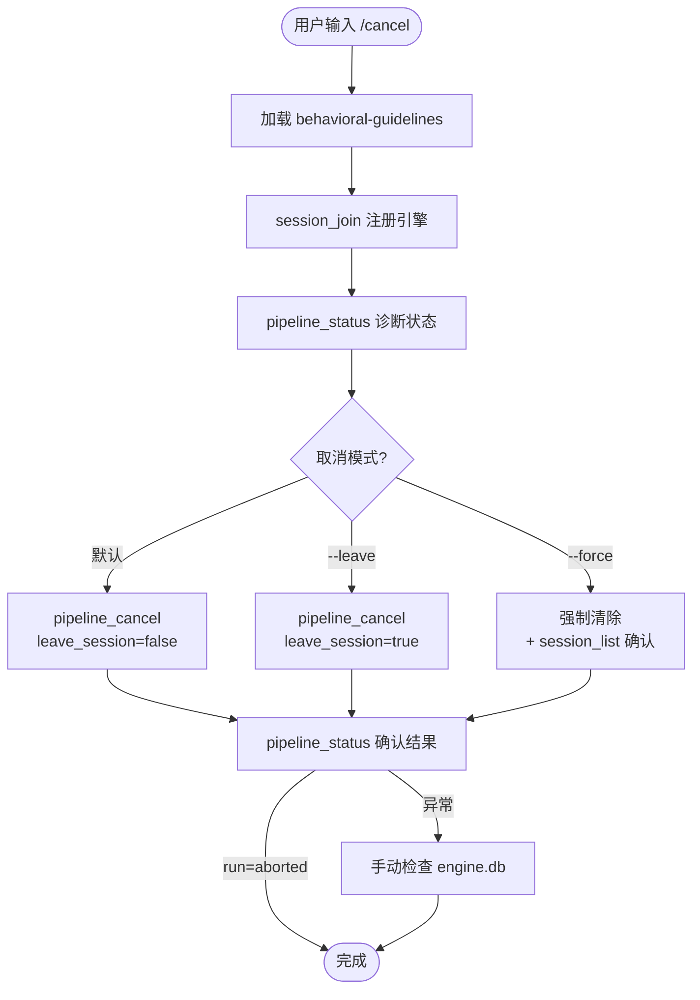

# `/cancel` — 取消流水线运行

- **命令**：`/cancel [--leave | --force]`
- **类别**：流程管理
- **说明**：中止活跃流水线运行，清理恢复数据，确保无僵尸任务残留。

## 使用场景

| 场景 | 参数 | 说明 |
|------|------|------|
| 取消当前任务，换新任务 | (默认) | 仅取消活跃 run，保留会话 |
| 彻底退出当前会话 | `--leave` | 取消 run 并离开会话 |
| 会话状态异常时修复 | `--force` | 强制清除所有会话状态 |
| 子 Agent 中取消 | ❌ 禁止 | 取消是编排者权限，子 Agent 无权操作 |

## 流程步骤

1. **加载技能 + 注册引擎**：`Skill("behavioral-guidelines")` + `session_join`
2. **诊断当前状态**：`pipeline_status()` 确认活跃 run ID、当前 Gate、任务名称
3. **执行取消**：
   - 默认模式：`pipeline_cancel({ leave_session: false })` — run 标记 `aborted`，保留会话
   - `--leave` 模式：`pipeline_cancel({ leave_session: true })` — 移除会话
   - `--force` 模式：强制清除后验证明细
4. **确认结果**：再次调用 `pipeline_status()` 确认 run 已标记 `aborted`

## 与其他指令的关系

| 后续操作 | 推荐路径 |
|---------|---------|
| 换新任务 | `/cancel` → `/auto "新任务"` 或 `/jarvis "新任务"` |
| 换专门指令 | `/cancel` → `/backend` / `/frontend` / `/hotfix` 等 |
| 彻底退出 | `/cancel --leave` |

## 中断各指令全表

`/cancel` 统一通过 `pipeline_cancel` 清理所有 31 条指令的引擎状态。以下按指令类别列出中断行为和恢复方式。

### 编排入口

| 指令 | Cancel 清理 | 中断影响 | 恢复 |
|------|------------|---------|------|
| `/jarvis` | run→aborted, 清除 resume 数据 | 当前 Gate 进度丢失，`.jarvis/` 文档保留 | 重启 `/jarvis` 新建 run |
| `/auto` | 路由到的流水线 run→aborted | 按路由结果清理 | 重启 `/auto` 重新路由 |

### 平台开发

| 指令 | Cancel 清理 | 中断影响 | 恢复 |
|------|------------|---------|------|
| `/frontend` | run→aborted | C1.5 截图丢失 | 重启 `/frontend` |
| `/backend` | run→aborted | DB schema 变更如已执行不可回滚 | 重启 `/backend` |

### 维护流程

| 指令 | Cancel 清理 | 中断影响 | 恢复 |
|------|------------|---------|------|
| `/bug-fix` | run→aborted | 已修复代码保留，未验证 | 重启验证或手动测试 |
| `/hotfix` | run→aborted | 代码保留但流程未完成 | 重启或手动完成 |
| `/refactor` | run→aborted | ⚠ 部分重构可能不一致 | `git stash` 后重启 |
| `/simplify` | run→aborted | 部分简化代码保留 | 重启 |
| `/improve` | run→aborted（中断迭代循环） | 基准数据丢失，代码保留 | 重启需重新基准测试 |

### 测试

| 指令 | Cancel 清理 | 中断影响 | 恢复 |
|------|------------|---------|------|
| `/test-unit` | run→aborted | 测试结果丢失，代码未变 | 重启 |
| `/test-e2e` | run→aborted | 浏览器会话关闭 | 重启需重配浏览器 |
| `/test-integration` | run→aborted | 集成测试结果丢失 | 重启 |
| `/test-perf` | run→aborted | 性能数据不完整 | 重启 |
| `/test-security` | run→aborted | 扫描结果丢失 | 重启 |

### 审查

| 指令 | Cancel 清理 | 中断影响 | 恢复 |
|------|------------|---------|------|
| `/audit` | run→aborted（只读，安全取消） | 审查报告不完整 | 重启 |
| `/review-fix` | run→aborted | 已修复代码保留，复审未完成 | 重启继续 |

### 调研（全部只读，安全取消）

| 指令 | Cancel 清理 | 中断影响 | 恢复 |
|------|------------|---------|------|
| `/research` | run→aborted | 研究报告不完整 | 重启 |
| `/trace` | run→aborted | 追踪分析不完整 | 重启 |
| `/evaluate` | run→aborted | 评估报告不完整 | 重启 |

### 工程流程

| 指令 | Cancel 清理 | 中断影响 | 恢复 |
|------|------------|---------|------|
| `/publish` | run→aborted | ⚠ 如已提交/推送/打Tag则不可逆 | 手动回退 Tag，重启 |
| `/release` | run→aborted | 版本号如已递增需回退 | 手动回退后重启 |
| `/sync` | run→aborted | 部分文档可能已修改（git checkout 可恢复） | 重启 |
| `/migrate` | run→aborted | 部分迁移代码保留 | 重启 |
| `/debug` | run→aborted（只读诊断） | 诊断数据丢失 | 重启 |

### 流程管理

| 指令 | Cancel 清理 | 中断影响 | 恢复 |
|------|------------|---------|------|
| `/cancel` | 自我取消 | 已在取消中，再次取消即退出 | N/A |
| `/skill-flow` | run→aborted | save 中途取消则 SKILL.md 不完整 | 重启 `/skill-flow save` |
| `/task-design` | run→aborted | TASK-XXX 不完整 | 重启 |

### 技术咨询（全部只读）

| 指令 | Cancel 清理 | 中断影响 | 恢复 |
|------|------------|---------|------|
| `/ask` | run→aborted（只读对话） | 探询上下文丢失 | 重启 |
| `/consult` | run→aborted（只读对话） | 专家分析上下文丢失 | 重启 |
| `/browser` | run→aborted | 浏览器探索上下文丢失 | 重启 |

### 安全性总结

| 类别 | 指令数 | Cancel 安全性 |
|------|-------|-------------|
| 编排入口 | 2 | ✅ 安全 — 文档保留 |
| 平台开发 | 3 | ✅ 安全 — 文档保留 |
| 维护流程 | 5 | ⚠ 中等 — 代码部分保留，建议 `git diff` |
| 测试 | 5 | ✅ 安全 — 代码未变更 |
| 审查 | 2 | ✅ 安全 — audit 只读；audit-fix 代码保留 |
| 调研 | 3 | ✅ 安全 — 全部只读 |
| 工程流程 | 5 | ⚠ 注意 — publish/release 有副作用（提交/标签不可回滚） |
| 流程管理 | 3 | ✅ 安全 |
| 技术咨询 | 3 | ✅ 安全 — 只读对话 |

## 边缘情况处理

### 在 Gate 中途取消
- 当前 Gate checkpoint 已记录则保留，未记录则丢失
- `advance_gate` 前的取消：Gate 未推进，下次从当前 Gate 开始
- `advance_gate` 后的取消：Gate 已推进，下次从下一 Gate 开始

### 在 Team 模式中取消
- 先 `shutdown_request` 通知 Team 成员
- 再 `pipeline_cancel` 清理引擎状态
- 如有需要手动 `TeamDelete` 清理残留

### 在 Agent spawn 中取消
- 已 spawn 的 Agent 可能还在运行
- `/cancel` 不负责杀死 Agent 进程（Agent 由平台管理）
- 引擎层面 run 标记 aborted 后，后续 Agent 无法推进 Gate

### 多次连续取消
- 第二次 `/cancel` 发现无活跃 run → 提示"无活跃运行"或直接退出
- `--force` 模式不检查状态，直接执行清除

## 与其他指令的关系

## 关键 Agent

此命令不 spawn Agent。所有操作通过 MCP 工具直接完成：
- `mcp__jarvis-engine__session_join` — 注册引擎
- `mcp__jarvis-engine__pipeline_status` — 诊断状态
- `mcp__jarvis-engine__pipeline_cancel` — 执行取消

