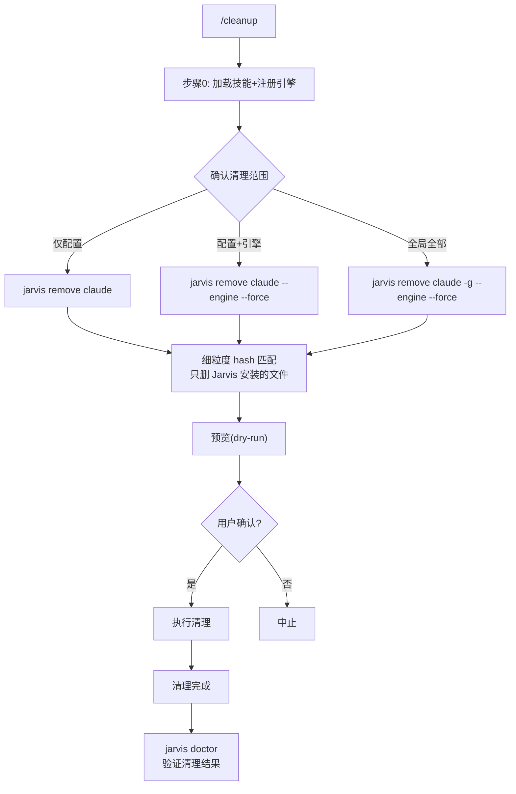

# `/cleanup` — 安全清理 Jarvis

> 细粒度移除 Jarvis 安装文件，不误删用户自有文件

## 清理内容

| 清理项 | 机制 |
|--------|------|
| `.claude/agents/` 模板 | Hash 匹配 → 只删 Jarvis 安装的 |
| `.claude/commands/` 模板 | Hash 匹配 → 只删 Jarvis 安装的 |
| `.claude/skills/` 模板 | Hash 匹配 → 只删 Jarvis 安装的 |
| `.mcp.json` | 只移除 jarvis-engine + playwright |
| `settings.json` hooks | 只移除 `_jarvisManagedHooks` 标记的 |
| `.jarvis/engine.db` | 需 `--engine` 标志 |
| `.jarvis/YYYY-MM-DD/` | 需 `--engine` 标志 |

## 红线

- 绝不删除用户自有文件（Hash 不匹配则跳过）
- `.jarvis/` 引擎数据需显式 `--engine`
- `--dry-run` 先预览，再执行
