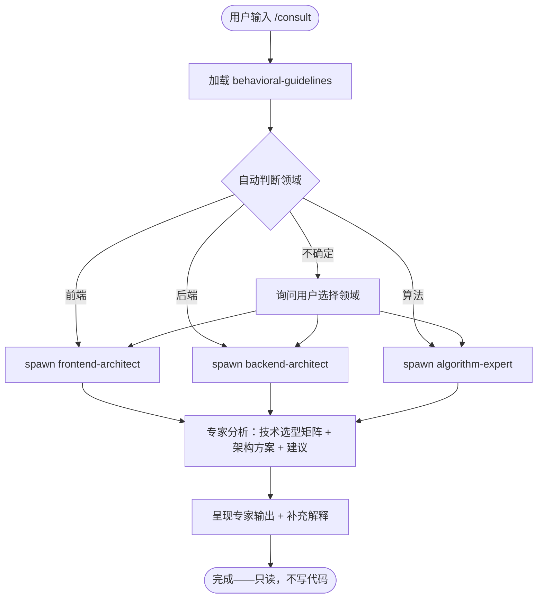

# `/consult` — 架构师对话模式

- **命令**：`/consult [--expert frontend-architect|backend-architect|algorithm-expert] [问题描述]`
- **类别**：技术咨询
- **说明**：与技术架构专家直接对话，进行架构方案讨论、技术选型与方案设计。仅讨论不写代码。

## 使用场景

| 场景 | 专家 | 典型问题 |
|------|------|---------|
| 前端技术选型 | `frontend-architect` | 框架选型、组件架构、状态管理、构建工具链、性能架构 |
| 后端架构设计 | `backend-architect` | API 设计、数据库架构、微服务拆分、部署拓扑、缓存策略 |
| 算法复杂度分析 | `algorithm-expert` | 算法选择、数据结构优化、搜索排序推荐策略 |
| 项目启动咨询 | 自动判断 | 新项目技术栈建议、架构评审 |

## 流程步骤

1. **加载基座**：`Skill("behavioral-guidelines")`
2. **判断领域**：从用户输入自动判断 → 前端/后端/算法，无法确定则询问
3. **确认问题边界**：项目背景、当前技术栈、核心痛点、已有倾向方案
4. **spawn 专家 Agent**：调用 `Agent` 工具 spawn 对应架构师进行专业分析
5. **呈现结果**：将专家输出完整呈现，必要时补充解释

## 关键 Agent

| Agent | subagent_type | 职责 |
|-------|-------------|------|
| 前端架构师 | `frontend-architect` | 技术选型、组件架构、状态管理、构建工具链 |
| 后端架构师 | `backend-architect` | API 设计、数据库架构、微服务拆分 |
| 算法专家 | `algorithm-expert` | 算法复杂度分析、数据结构选择、策略推荐 |

**约束**：不要自己替代专家做分析——必须通过 Agent 工具 spawn；仅 read 操作，不写代码。

