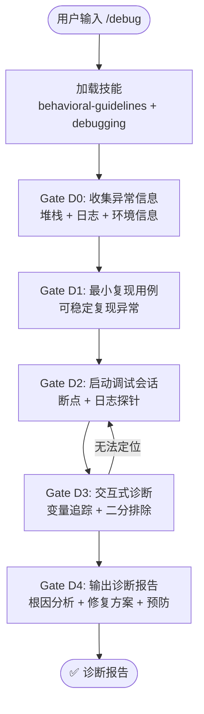

# `/debug` — 调试诊断

- **命令**：`/debug [异常描述或堆栈信息]`
- **类别**：诊断流程
- **说明**：交互式调试诊断流程，通过收集异常信息、构建最小复现用例、变量追踪和二分排除，输出完整的根因分析与修复方案。

## 使用场景
| 场景 | 说明 |
|------|------|
| 运行时异常排查 | 应用崩溃、未捕获异常、运行时错误 |
| 性能瓶颈诊断 | 响应慢、内存泄漏、CPU 占用过高等问题 |
| 环境差异问题 | 本地正常但部署环境异常的兼容性问题 |
| 依赖冲突排查 | 包版本冲突、构建异常、加载失败等 |

## 关键 Agent
| Agent | 职责 |
|-------|------|
| code-explore-expert | 代码探索与异常模式识别 |
| browser-test-expert | 浏览器端调试与复现验证 |

## 流程图

