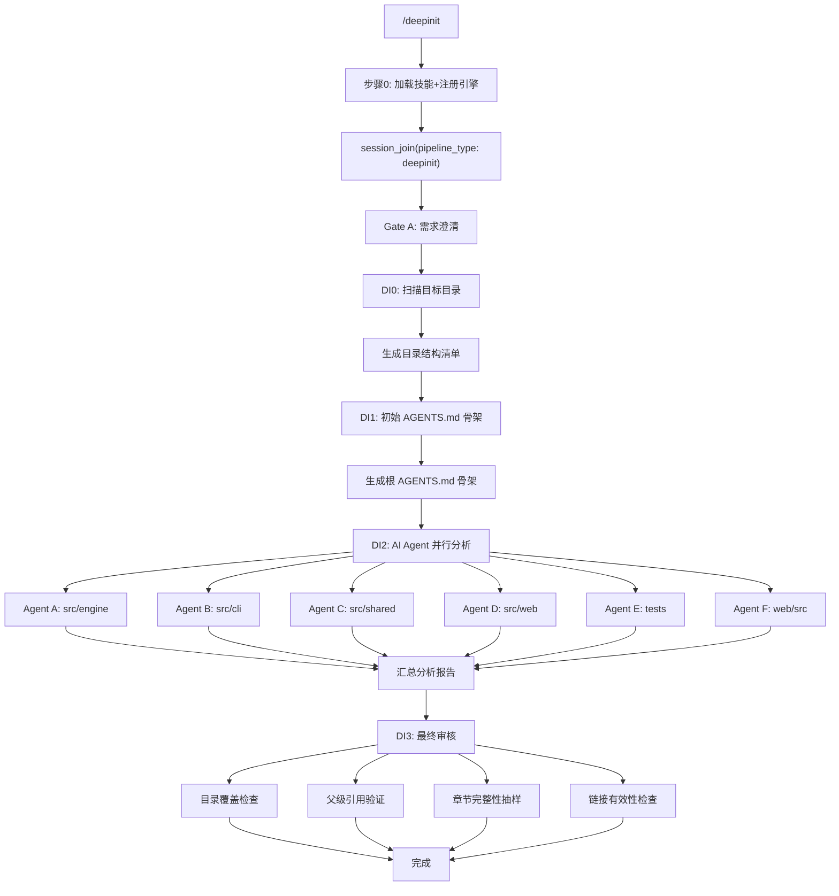

# `/deepinit` — AI 驱动的分层架构文档初始化

> 扫描项目完整目录树，为每个目录级联生成 AGENTS.md + CLAUDE.md

## Gate 序列

| Gate | 产物 | 说明 |
|------|------|------|
| Gate A | 需求文档 | 确认初始化范围 |
| DI0 | 目录清单 | 扫描并排除 node_modules/.git/dist |
| DI1 | 根 AGENTS.md | 骨架 + 整体架构图 |
| DI2 | 各模块 AGENTS.md | AI Agent 并行读取源码生成 |
| DI3 | 审核报告 | 覆盖率/引用/章节/链接 4 维验证 |
