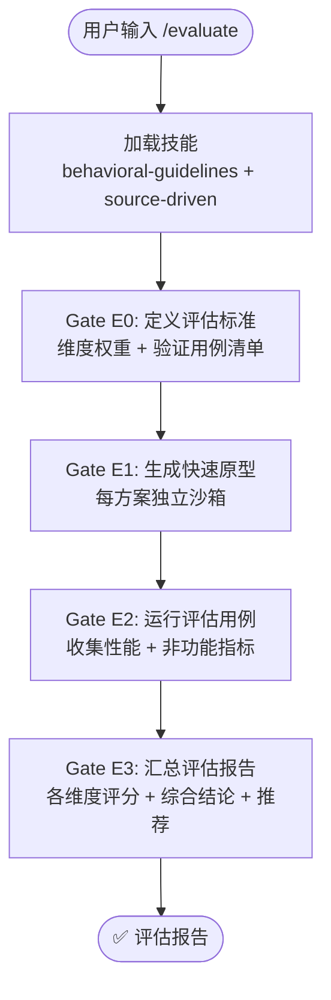

# `/evaluate` — 方案评估对比

- **命令**：`/evaluate [评估目标描述]`
- **类别**：调研
- **说明**：对多个技术方案进行系统化评估，定义维度权重、运行验证用例并生成综合评分报告。

## 使用场景

| 场景 | 说明 |
|------|------|
| 框架选型对比 | 多个候选框架（如 React vs Vue vs Svelte）的功能、性能与生态评估 |
| 架构方案比选 | 不同架构方案（如微服务 vs 模块化单体）的成本、复杂度与可扩展性对比 |
| 第三方库评估 | 对候选依赖库进行安全性、维护活跃度、许可证与性能对比 |
| 技术迁移可行性 | 评估从旧技术栈迁移到新技术栈的风险、工作量与收益 |

## 关键 Agent

| Agent | 职责 |
|-------|------|
| `code-explore-expert` | 代码与技术方案调研，收集各方案的实现细节与性能数据 |
| `external-resource-expert` | 外部资源整合，获取官方文档、基准测试与社区评价 |

## 流程图

