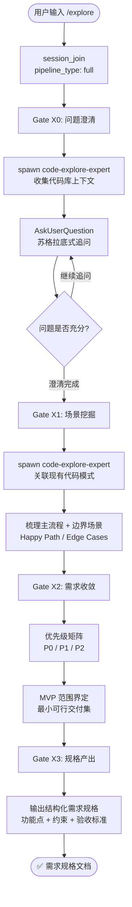

# `/explore` — 需求探索流程图

```mermaid
flowchart TD
    START([用户输入 /explore]) --> JOIN[session_join<br/>pipeline_type: full]
    JOIN --> X0[Gate X0: 问题澄清]
    X0 --> X0A[spawn code-explore-expert<br/>收集代码库上下文]
    X0A --> X0Q[AskUserQuestion<br/>苏格拉底式追问]
    X0Q --> X0E{问题是否充分?}
    X0E --> |继续追问| X0Q
    X0E --> |澄清完成| X1[Gate X1: 场景挖掘]
    X1 --> X1A[spawn code-explore-expert<br/>关联现有代码模式]
    X1A --> X1S[梳理主流程 + 边界场景<br/>Happy Path / Edge Cases]
    X1S --> X2[Gate X2: 需求收敛]
    X2 --> X2P[优先级矩阵<br/>P0 / P1 / P2]
    X2P --> X2M[MVP 范围界定<br/>最小可行交付集]
    X2M --> X3[Gate X3: 规格产出]
    X3 --> X3S[输出结构化需求规格<br/>功能点 + 约束 + 验收标准]
    X3S --> DONE([✅ 需求规格文档])
```
