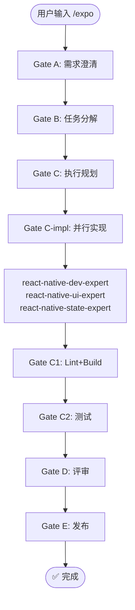

# `/expo` — Expo 跨端开发生命周期流程图

```mermaid
flowchart TD
    START([用户输入 /expo]) --> A[Gate A: 需求澄清]
    A --> B[Gate B: 任务分解]
    B --> C[Gate C: 执行规划]
    C --> CI[Gate C-impl: 并行实现]
    CI --> CI1[react-native-dev-expert<br/>react-native-ui-expert<br/>react-native-state-expert]
    CI1 --> C1[Gate C1: Lint+Build]
    C1 --> C2[Gate C2: 测试]
    C2 --> D[Gate D: 评审]
    D --> E[Gate E: 发布]
    E --> DONE([✅ 完成])
```
